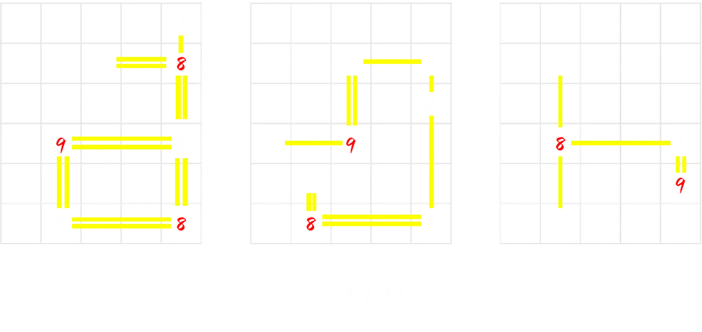

# 你的名字。

## 题面

即使天各一方，只要呼唤彼此相同的名字，我们之间共享的羁绊就永远不会消失。无**数桥**梁都传达着孤岛间的思念……

## 答案

<AnswerBlock>LIES AND SORROW</AnswerBlock>

## 解析

非常壮观的一道题。首先第一层如加粗部分所暗示的，是数桥游戏的变体。通过尝试和文本（neta自紫罗兰永恒花园）理解可以发现，红色部分的数字都太大了，可以意识到红色部分实际上是“在不同的地图里共享桥数的部分”。

也就是可能会有来自不同表格的“岛”共享它们的连接数。也就是说，同一组共享连接数的“岛”，会显示相同的桥数（是组内所有“岛”单独连接数之和），而它们会是红色。存在多组这样共享连接数的“岛”。

于是我们得到如下结果：

画完之后，观察每张图里双线的部分，能够发现组成了单词metro。

带着这样的信息，我们去观察第六张图，发现其前几行能隐隐约约看到一句话stack up and use the word you have got as the key to decipher the following。但是，前几行有几个格子不包含在这句话内，有些怪异。但总而言之，我们可以先听它的，把它叠起来然后看看发生了什么。

然后我们就可以发现，原来我们能读出来的都是没有被之前的桥和岛遮挡住的内容！带着这样的想法，我们也知道了上面所说的the following也就是没有被遮挡住的密文：

flxwwhivzhuilrfqfxzxurzjvqrsyszrtexurztvarzhwzkarbsdafiflxeturwrzxxavpdmwxseegusjxkrqfevtcdhbeufsmysuvifguxbfbejkfaflbjhmfevozhmysnvbuuqwtisxsvrhqhhepdmwxsechlvmzxsiupm

然后，我们用我们得到的metro进行维吉尼亚解密，得到了如下信息：

thefivecitiesarebeijingshenzhennanjingchongqinghangzhouthenfindallthebridgesandextractaccordingtotheirpositionsfromthistableandthebridgesarelocatedonbridgesyouhavebuilt
（这五个城市分别是北京、深圳、南京、重庆、杭州。然后，找到所有的桥并根据这些桥的位置来从这张表中提取。另外，这些桥在你所建造的桥上。）

联系我们得到的metro，容易联想到我们要检查这五个城市的地铁！除此之外，联想到题目文案里的“即使天各一方,只要呼唤彼此相同的名字,我们之间共享的羁绊就永远不会消失”，可以想到，但凡是共享桥数的岛屿，一定是名字相同的地铁站。既然如此，“岛”应该是地铁站，那么我们的“桥”应该是地铁。

我们可以先找到这几个城市地铁网里同名的地铁站：

从而，我们可以根据其中每两个城市共有的站点确定某一红色系列的内容的具体构成是什么。接下来根据地铁的背景，很容易联想到整个数桥的含义：

1.桥上的每个格子都是一个地铁站2.同一座岛屿上的呈直角的两座桥，一定代表着不同的地铁线路3.架构仅代表拓扑关系，不代表真实的方位关系4.地铁线路仅为片段，不一定为全长

那么，bridges on bridges you have built的含义就很清晰了：在数桥上的作为“桥”（名字里含有“桥”）的站点。于是我们先通过那些同名的桥确认出地铁线路，找到图上剩下的地铁站里的含有“桥”的站点，最后在最后一张图上找到对应的格子——

从上到下，从左到右读取，得到答案lies and sorrow.

## 作者

Winfrid
