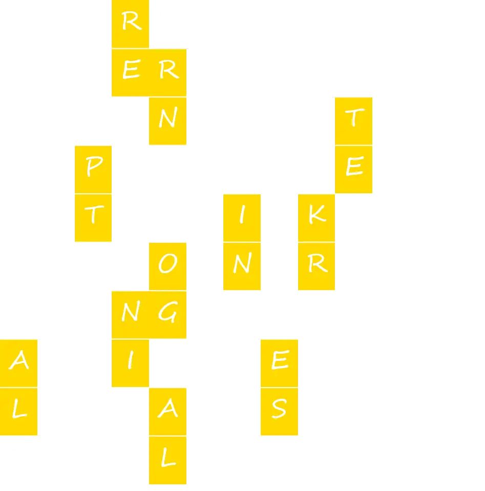

# Meta：金银岛

## 题面

“你要怎么上下拼接起这些章节呢？”

“剧情主线？伏笔回收？啊，总之一切沾了点边的元素都可以。别来那种流血的铁腥味就好。”

## 答案

<AnswerBlock>DAYDREAM</AnswerBlock>

## 解析

从“金银岛”和文本不难看出，这里需要把得到的9个13字母答案放入合适的位置，让红色方框里的内容（也就是“拼接”所用的连接物）从上往下读是两个字母的化学元素，但不是Fe.

取字母得到bairimeng，输入得到回复“所以，答案应该是bairimeng的英文——”，于是按照指示，daydream是答案。

## 作者

Winfrid
