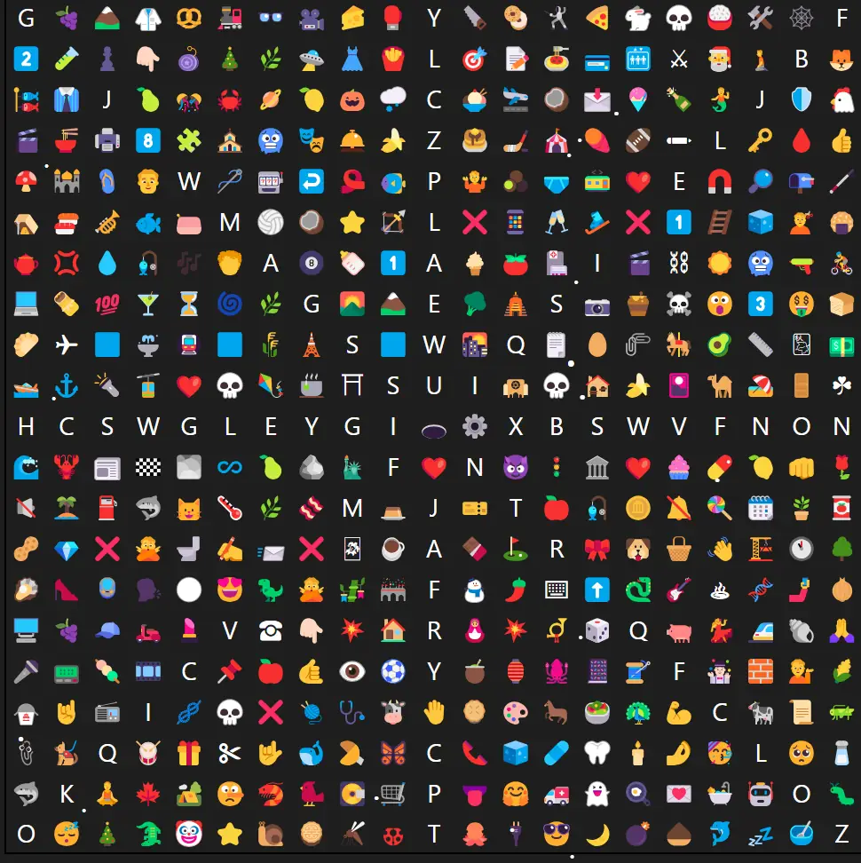
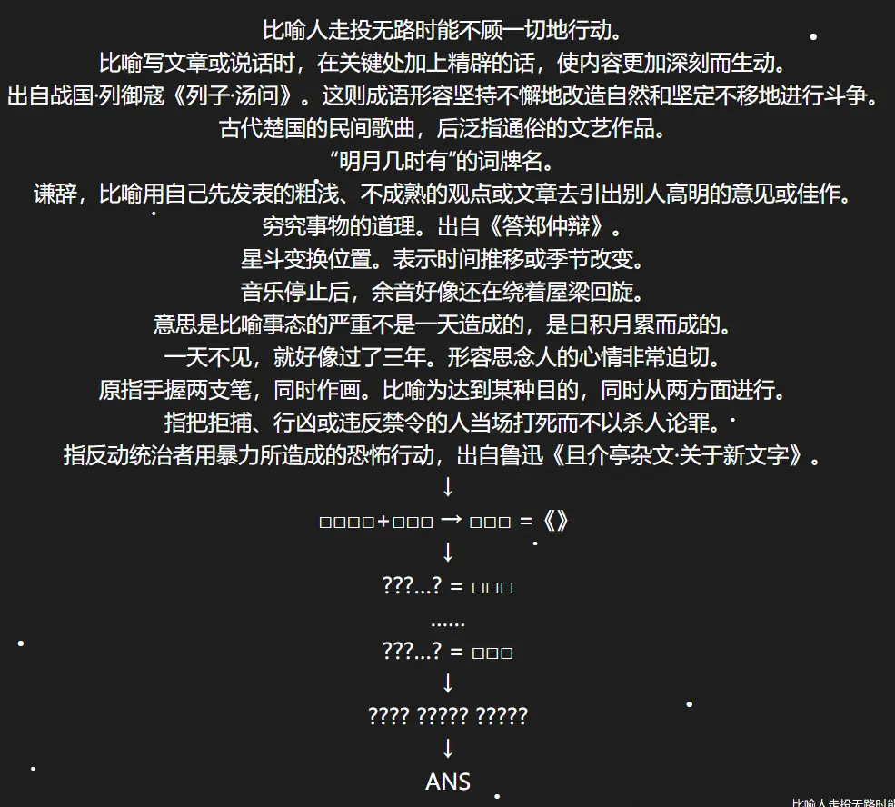
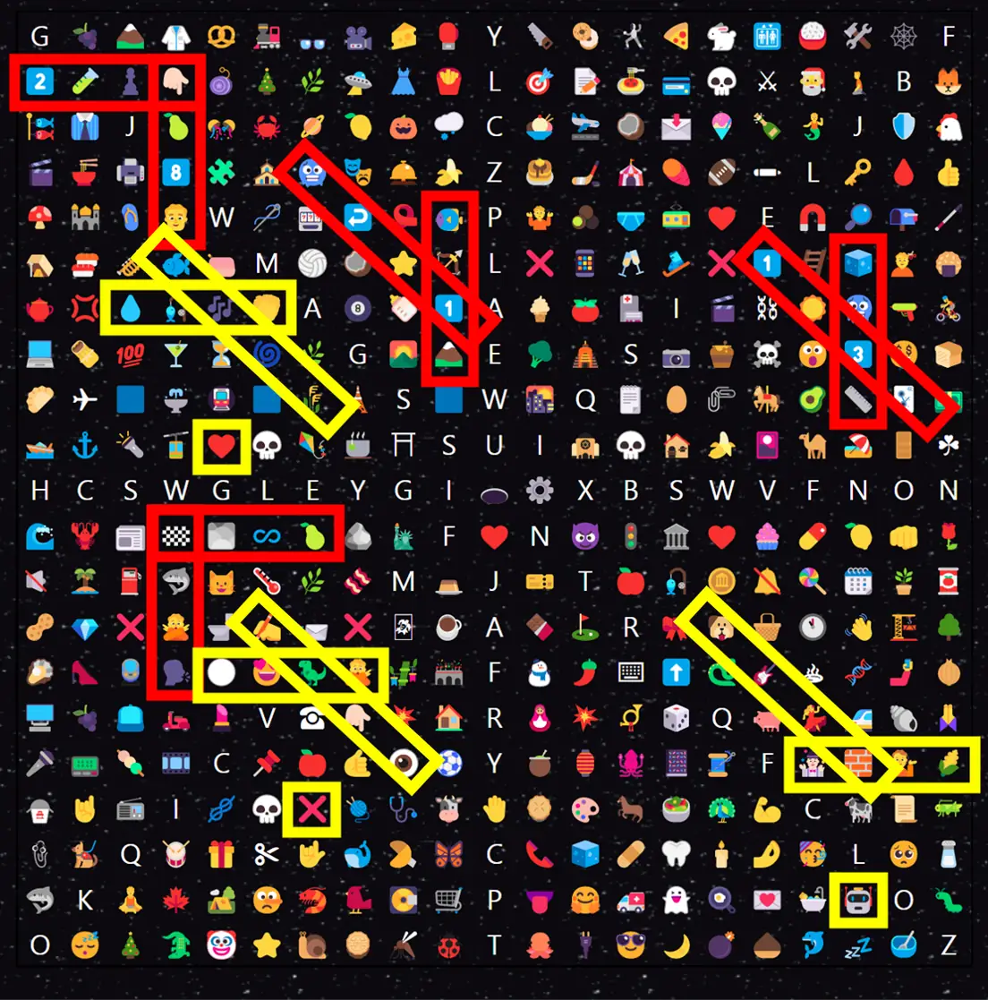
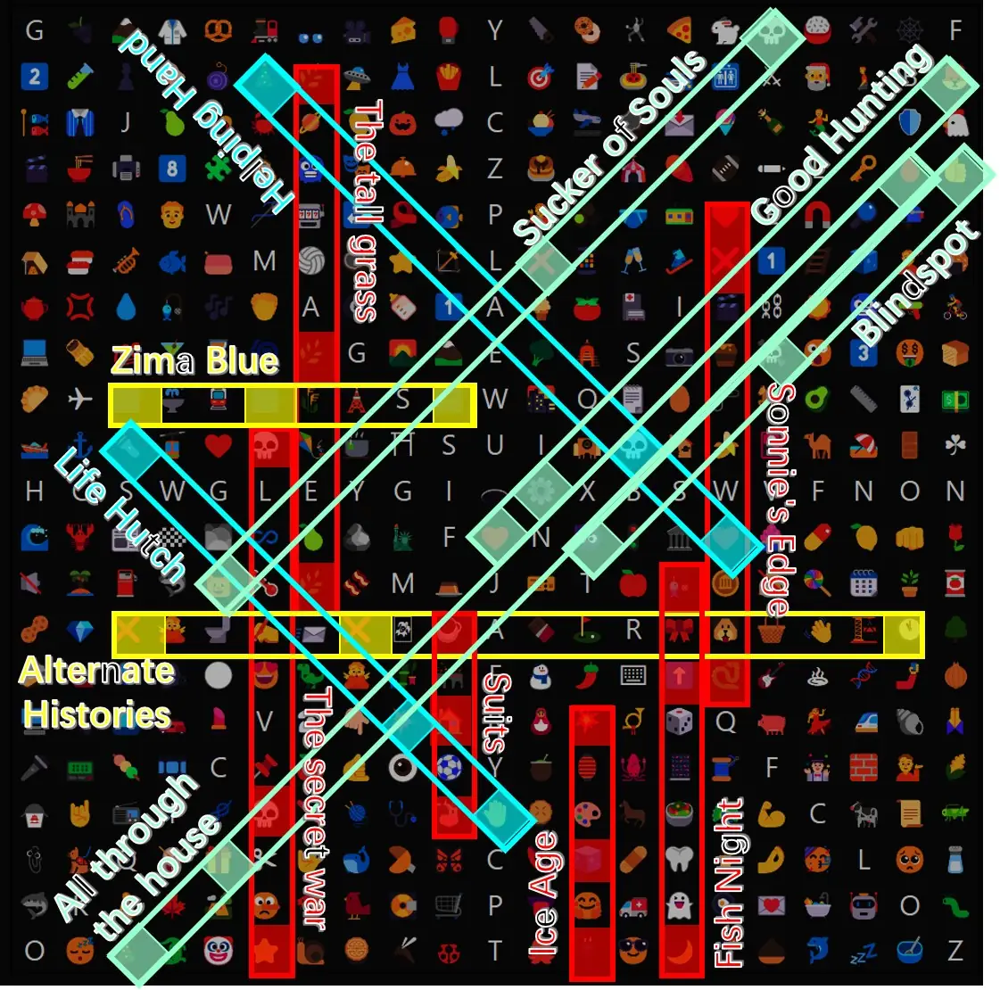
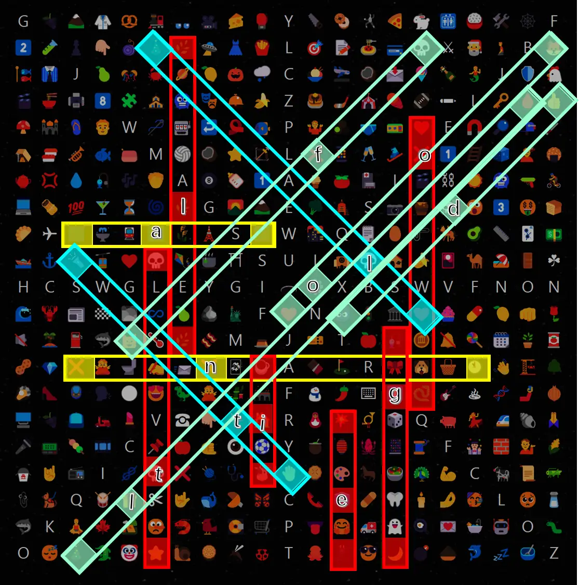
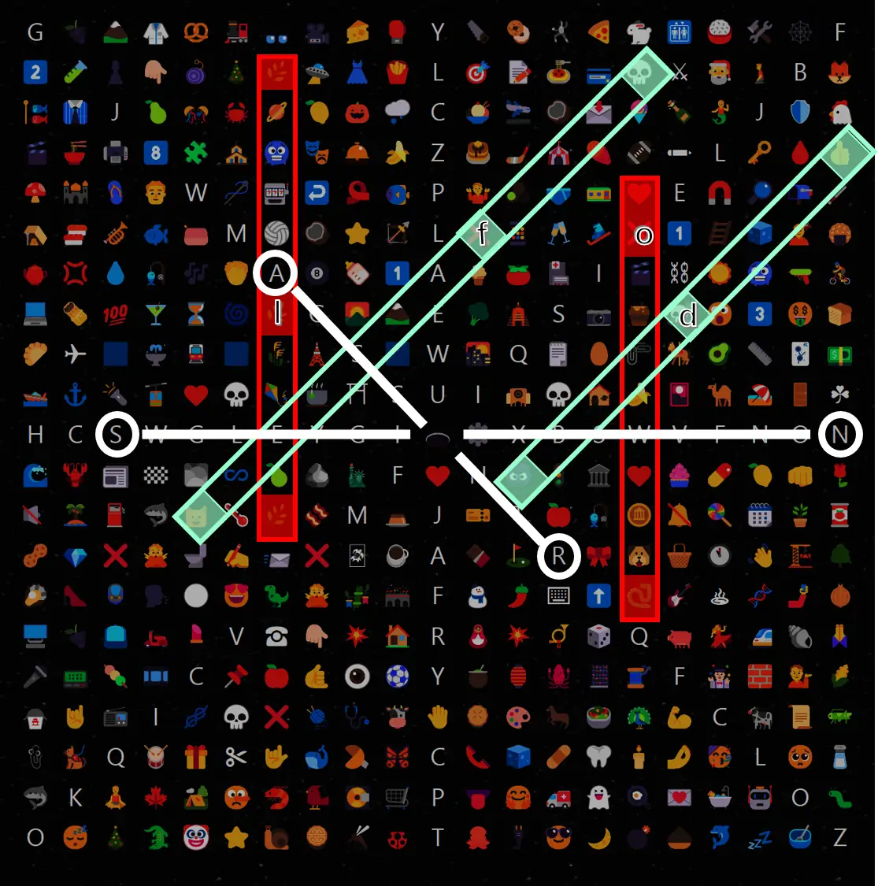

# 岛屿：洞状视界

## 标题

望着这些满是图标、中间还有个洞的方格纸，我的脑海里浮现出了……一个又一个三题故事。

（注：不必在意表格中的排版要素，如对齐方式、字体等）

<!------>

比喻人走投无路时能不顾一切地行动。  
比喻写文章或说话时，在关键处加上精辟的话，使内容更加深刻而生动。  
出自战国·列御寇《列子·汤问》。这则成语形容坚持不懈地改造自然和坚定不移地进行斗争。  
古代楚国的民间歌曲，后泛指通俗的文艺作品。  
“明月几时有”的词牌名。  
谦辞，比喻用自己先发表的粗浅、不成熟的观点或文章去引出别人高明的意见或佳作。  
穷究事物的道理。出自《答郑仲辩》。  
星斗变换位置。表示时间推移或季节改变。  
音乐停止后，余音好像还在绕着屋梁回旋。  
意思是比喻事态的严重不是一天造成的，是日积月累而成的。  
一天不见，就好像过了三年。形容思念人的心情非常迫切。  
原指手握两支笔，同时作画。比喻为达到某种目的，同时从两方面进行。  
指把拒捕、行凶或违反禁令的人当场打死而不以杀人论罪。  
指反动统治者用暴力所造成的恐怖行动，出自鲁迅《且介亭杂文·关于新文字》。  
↓  
□□□□+□□□ → □□□ =《》  
↓  
???…? = □□□  
……  
???…? = □□□  
↓  
???? ????? ?????  
↓  
ANS

## 答案

<AnswerBlock>RAINY NIGHTS</AnswerBlock>

## 解析

非常壮观的另外一题。

表格下面的首字母顺序排列的线索分别对应着：狗急跳墙、画龙点睛、愚公移山、下里巴人、水调歌头、抛砖引玉、格物穷理、斗转星移、余音绕梁、冰冻三尺、一日三秋、双管齐下、格杀勿论、白色恐怖。于是先去表格里找到这些成语/词语的emoji版本。

非常有意思的是，这里的十四个成语正好构成了七个相交的组合，而且其中的四个里，交点的emoji对应的字是相同的（双管齐下和下里巴人，斗转星移和愚公移山，冰冻三尺和一日三秋，格物穷理和格杀勿论）；剩下的三个里，交点的emoji对应的字是不同的（余音绕梁和水调歌头，画龙点睛和白色恐怖，狗急跳墙和抛砖引玉）。

这正好对应着原题下方提示性的“????+???”，前者四个相同的汉字组合起来正好是“下移三格”，正好和后者的三个emoji组合，得到新的三个emoji（“????+???=???”），也就是上图中被黄框圈出的❤❌🤖。而搜索得知这三个emoji正好是一部作品《爱、死亡和机器人》的对应的图标。（“???=《》”）

下一步，通过了解可以发现《爱、死亡和机器人》和图标很有联系：不止作品名表示成三个图标，而且每集的开头都会用三个富有特征的emoji图标来概述这一集的内容（例如，你可以在[爱死机的fandom](https://lovedeathrobots.fandom.com/wiki/LOVE_DEATH_%2B_ROBOTS)的分集词条的一开始找到这些emoji，也可以用百度搜索“爱，死亡和机器人 图标”得到），呼应着题目文案的“三题故事”。

所以，下一步的过程就是找到这些图标组合，从最显眼的三个蓝色方块开始可能是很好的想法。事实上，可以找到14集这样的emoji图标组合，而且它们都排在一条线上，如下图所示：

更巧的是，它们首尾之间的emoji的数量正好等于对应剧集的字母长度，而中间的emoji的排布并没有一定的规律。但是我们可以利用中间的emoji在首尾emoji构成的emoji序列的第几位，来对应地从剧集的英文名中提取字母。

所以，通过按照位置从上到下地读取这些字母，得到了???? ????? ?????就是fold along title。

而它的意思就是把这张纸沿着刚才的这些标题对折。接下来，令人一直困惑的，从中间的洞出发向八个方向有一串字母的这个细节就派得上用场了：把“方格纸”沿着刚才的这些标题所在的直线对折后，标题“洞状视界”提示我们，可以通过中间的“洞”去看背后的字母。而顺序依旧是按照刚刚fold along title这十四个字母所在的标题的排序。这样就可以得到一个十四个字母的字母串ANS RAINY NIGHTS。

这里的示意图可以帮助你理解为什么前四个字母是ANSR（反过来说，也可以通过文案里“ANS”这三个字符出现在了自己的字母串里从而验证自己的提取方式有没有正确）：

所以，答案为rainy nights。

## 作者

Winfrid
