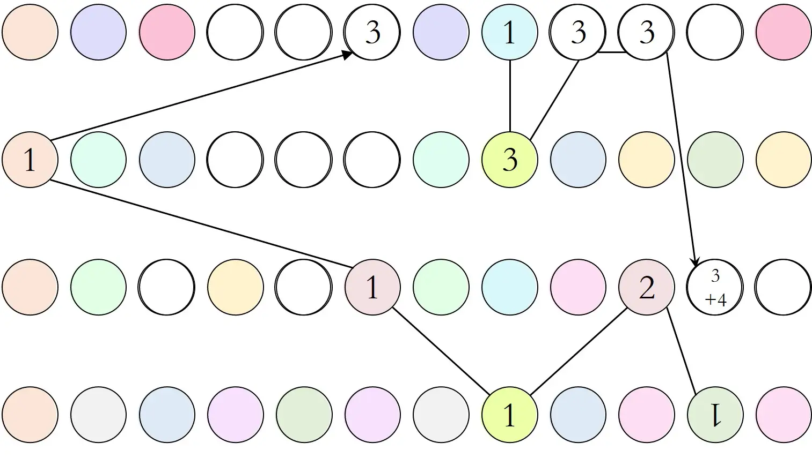

# 礁石：圆形世界

## 题面

彩色的拼图汇聚到灰色的底色上，书写着优雅而绚烂的、属于时间的篇章。

TODO: 图片缺失

## 答案

FUNNY PUZZLE

## 解析

“彩色的拼图汇聚到灰色的底色上”这句话暗示着要——先根据16张白色为主底色的图自身的信息推断出灰色遮盖的内容，再拼到一起成为完整的谜题，和最先那张灰色底色的图一起参照得到答案。

这张图中，相同形式的圆圈代表相同的汉字，最后能够看出来是二十四节气。按照数字x取拼音内第x个字母，括号内的加减代表字母的位移。得到答案funny puzzle。

**小题1**

根据水晶鞋的提示，第二行代表Cinderella，第一行是circle=○，所以灰色覆盖的三个圆圈代表cir，从而得到其颜色。

**小题2**

培根密码，得到的这五行的后四行分别代表ACON，所以可以看出第一行是B（bacon cipher），从而应该是三个无色圈。

**小题3**

左侧代表1\~10。右边四行分别为：八九不离十、九九八十一难、三下五除二、二一添作五。被遮挡住的是“八九不”。

**小题4**

手机九键的样貌。桃红色的四个字母为irst，所以被灰色遮挡住的def里，f应该是桃红色得到first。

**小题5**

金陵十二钗，分别为林黛玉、薛宝钗、贾元春、贾迎春、史湘云、妙玉、贾探春、贾惜春、王熙凤、贾巧姐、李纨、秦可卿。被遮挡住的是“贾迎春”。

**小题6**

这四行分别为white、orange、red、blue，然后最上面的一句话里的那个矩形实际上就是这整张图，对应的墨迹历经的字母是world（这一逻辑会在之后的小题出现）。被遮挡住的为三个白圈。

**小题7**

《两只老虎》的简谱。被遮挡住的为“跑得快”的音符。

**小题8**

微信表情。左侧的绿色点代表微信的眼睛，右侧这四双眼睛是每行第一个表情的眼睛。绿色代表不对称，米色代表左右对称。

**小题9**

标题为十二星座。下面就是十二个星座。被挡住的为“狮子座”。

**小题10**

一道会随着时间变化的很有先锋性质的小题。这张图随着比赛的进程，新的一天到来时箭头会向右移动。其实上面是P&KU1的比赛赛程（第一天晚上8点到最后一天晚上8点）。下面的文字是puzzle and key universe，被挡住的是zle。

**小题11**

上面左边是奥利奥的形象体现，也暗藏了黑色代表“奥”，白色代表“利”的逻辑。上面右边是oreo。下面左边是“奥，大利，亚”，右侧是australia。横线穿过的是leo。被灰色挡住的是tra。

**小题12**

大图为元素周期表的片段，这点从"B","C"可以看出。左上角的小图的黑色矩形和上面的逻辑一样，就代指整个这一页，红色矩形代表元素周期表。被选中的五个元素应当为O Mo Te Na Si，在日语中代表hospitality。所以被灰色遮挡住的部分为淡粉色的Te和其它两个元素。

灵感源自[2021日本的国际奥林匹克化学竞赛](http://www.icho2021.org/)的宣传图之一。

**小题13**

《静夜思》，被挡住的为“低头思”。

**小题14**

dong nan xi bei的拼音。

**小题15**

天线宝宝的名字。

**小题16**

填入成语，每条直线上的四个汉字能组成一个成语。分别为牙牙学语，学以致用，自学成才、自以为是。下方的成语为以眼还眼以牙还牙。
