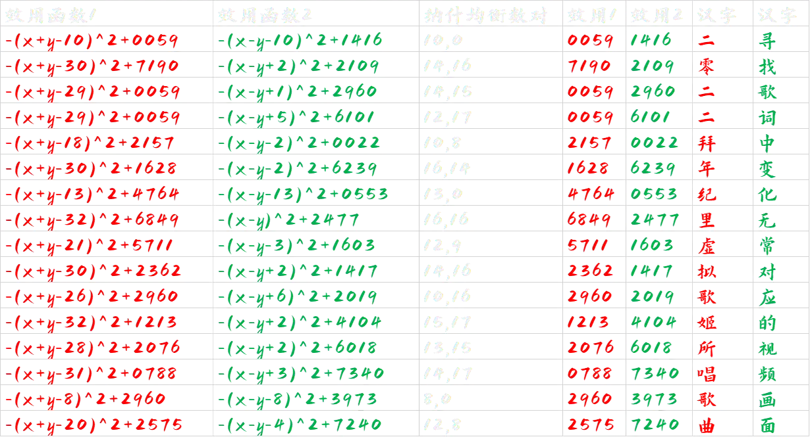
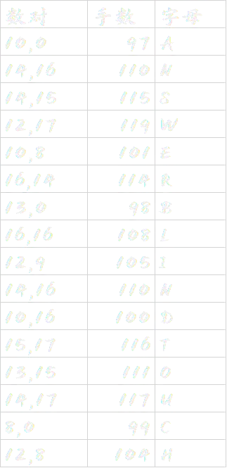

# 礁石：弈

## 题面

均衡，存乎万物之间——无关黑白，这里只有如**电码**和**手术**般的精准。  

（补丁：把这道题里的所有U的下标的x和y改成1和2，也就是，这并不是一个偏微分函数）  

点击[这里](https://statics.pku1.miaomiaomiao.com.cn/static/files/df4dc38b814c46739447db60a6022efc.pdf)下载本谜题的pdf文件。

## 答案

BLIND TOUCH

## 解析

根据提示，根据每组的效用函数，求出这些博弈的纳什均衡（大致是“固定对方的选择后，双方自己都不会改变自己的选择”），并算出对应的双方各自的效用。

注意到效用多为四位数形式，于是尝试用中文电码转汉字，得到——

根据提示找到苍穹演唱的《弈》，找到如下图片：

下面，需要通过多种查找方案（如，直接开弹幕发现，或者通过搜索“《弈》棋谱”得到），了解到这是李世石vsAlphago的第五局。

再根据纳什均衡数对对应的坐标，嵌入上述棋盘，以找到对应落子的“手数”（由文案的提示“无关黑白，只有手术”得到），发现多为100附近，故ASCII转字母。

得到答案blind touch.

## 作者

Winfird

## 附言

其实《弈》这首曲子本身就是用虚拟歌姬而非人去诠释同样非人的AI在围棋界的风雨——这种想法使我一度想要将其制作成一道关于AI背景的庞大的题目，但由于很难组合，因此最后还是退而求其次地以“博弈”来作为主题，非常惋惜地没能展现出其全貌。而散落的三道题其实分别是《你画我猜》《岛屿：为了你唱下去》和这一题。现在，AI也要进入虚拟歌姬调教领域了——未来又会怎么样呢？
