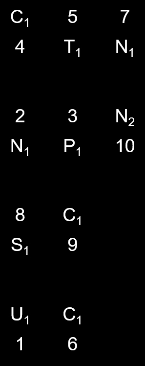

# Meta：水天之间

## 题面

我在岛屿与礁石的连接处流连。

从上到下是按照“相关度”由高到低排序的：同位置字母相同，相关度+1；同位置字母在字母表里相邻，相关度+0.1

## 答案

<AnswerBlock>MIND THE GAP</AnswerBlock>

## 解析

先按照题意排列好这四组，然后每一组里，岛屿的答案在上，礁石的答案在下。下标为2的N代表这个答案里的第二个N，需要找到另一个答案里相同位置的字母。

这样就可以得到答案mind the gap.
