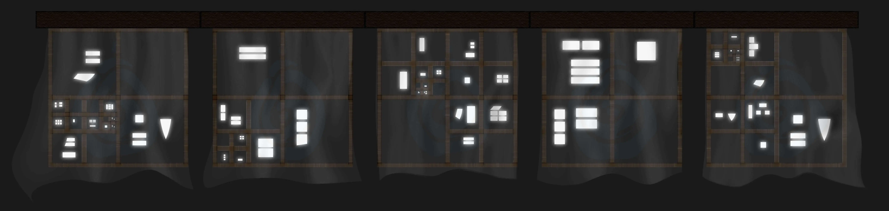
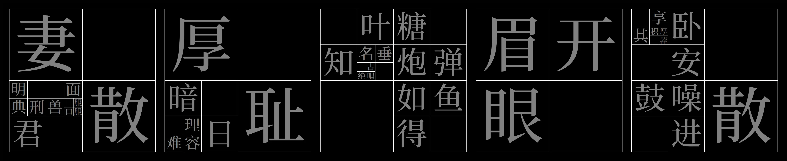
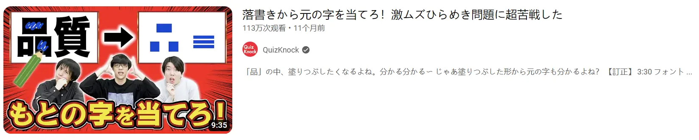
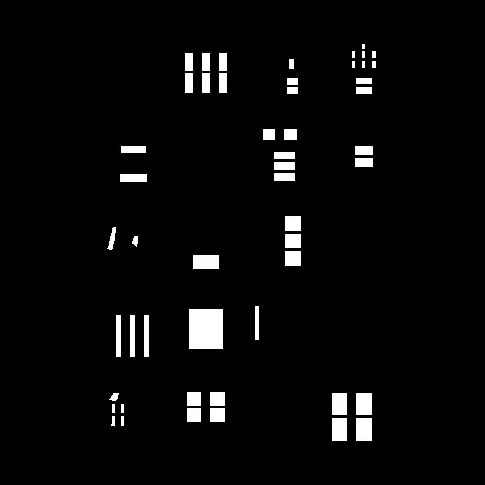
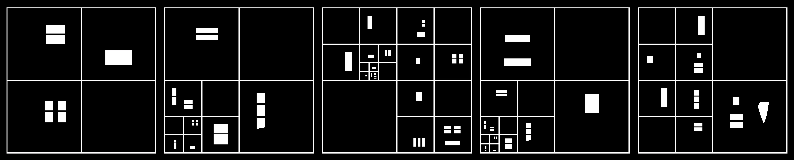
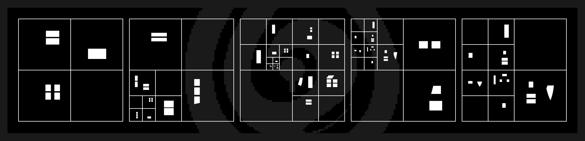

# 月照纱窗

## 题面

:::info
[P&KU2：月照纱窗](https://pnku2.pkupuzzle.art/#/game/miyu/prob_06)
:::

_月照纱窗，字字孔明诸格亮。_

## 答案

离颜带笑欢

## 解析

图里给出了众多窗格，每个小窗格里都有由月光色构成的封闭图形。与此同时，任何窗格的四分之一都是空白的。

通过“字字孔明诸格亮”的提示，以及对于汉字的熟识，我们能够发现其实**每个窗格的封闭图形都是同一个汉字里的封闭部分**！例如，第四个窗格里的前三个字其实是“眉开眼”——从而更加不难看出，剩下的那个字应该是成语“眉开眼笑”的“笑”，这个格子是空白的也正是因为“笑”这个字不含有封闭结构！

另外值得一提的是，在“大格套小格”的嵌套结构中，**内部空缺部分的汉字也就成为了整个格子在外侧组成成语时代表的汉字**。例如第二个窗格里最左下角是“天理难容”，空缺的汉字是“天”；而中等的窗格对应的成语是“暗无天日”，这里，更小部分推理出的“天”作为了成语的一部分；更大的窗格对应的成语是“厚颜无耻”，而刚刚的“无”成为了其中的一部分。

从而，我们利用成语的性质可以得到每个格子应该填的汉字。答案是**离颜带笑欢**。

## 作者

榆木华（设计）；Potto（美工）

## 附言

### 榆木华

这题是 P&KU2 制作来的第一道小题。整体的灵感来自 QuizKnock：（被 Inferno 吐槽直接用qk点子真的好吗）

当时看完这期之后我就觉得这是对汉字的一个绝佳的处理方式，不出在中文区那里可惜了。于是我就想着可以拿四个只剩框框的字来表示成语（其中三个有框一个没有），每个成语认出之后，就可以直接提取那个没有框的字，很自然。

但是只是这样的话，一个是**很难选答案**（因为要每个字都没有框），**也很难凑成语**（因为要其他三个字都有框，而且可以辨识），于是就暂时搁置一边了。下图所示的就是第二版，兼大改前最美观的版本：

Finalmeta 完善后，我们再次聊到时，草佬（Winfrid）提出了“可以递归”的想法。那成语就好选多了啊，首要问题是要能辨识，有几个字有框无所谓了，没有就迭代下去呗。

不过一开始的版本中，做题思路比较极限，难度很高，后面一削再削才有了现在这个突破口和思路都比较通畅的版本。下图就是第四版，也是没削难度的版本，不记得有没有 bug 了，总之感兴趣可以试试：

1. PS：这个闪出来的 ft “字字孔明诸格亮”我很满意，很喜欢这个用典与双关。
2. PPS：关于版本的话，前三版都是一行一行的版本，第三版加了点方便分隔的格子，四五六版就都是递归式的了，第五版开始有点美工，第六版作为终版交给 Potto 美工了。其他变化基本都是选字的改变，有考虑的包括：难度、美观、修锅、以及换成 fm 能用的答案(
3. PPPS：第二版美观主要美观在很符合“格”的设定，方方正正排了很多很帅。
4. PPPPS：我其实挺喜欢第五版的简约美工来着，包括另一个活动自己搞的简约美工也挺喜欢。但是这边被具象化了，而那边被手绘了一遍——下面就是第五版，它的美工有种简约之感。

 5. PPPPPS：其实看 qk 感觉很多很多点子都很妙，但是大概只有一小部分是可以挪用的。比如去掉宋体字的横划之后再尝试辨认等等，有能力的推荐多看看。

### Potto

这道题是 winfrid 交给我的的第一道题。那个时候我刚开始尝试出题，对图画软件的使用也不熟练，所以对 P&KU2 谜题美工这项任务心里其实挺没底的。不过感谢 winfrid 在图片制作中提供了大量灵感，让我在包括这道题在内的几乎所有谜题的美工阶段压力小了很多。赞美 winfrid。

### Winfrid

我觉得算是 P&KU2 里贴近《繁华唱遍》生态位的一道题——谜题动机明确、设计自然、入手点多、美工精致、ft+标题+题面+答案浑然一体、也对答案本身有很高的要求。作为优雅的单题很能打。
