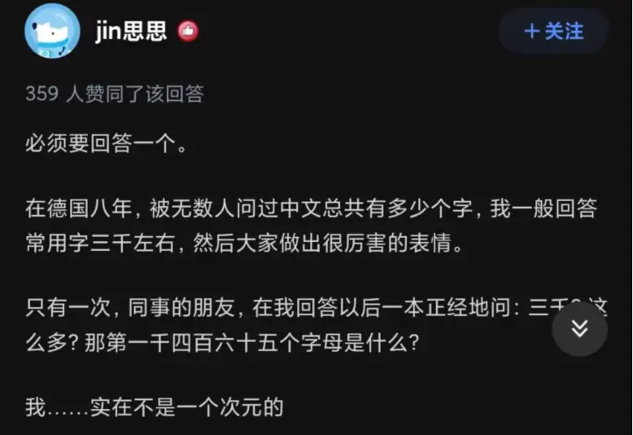
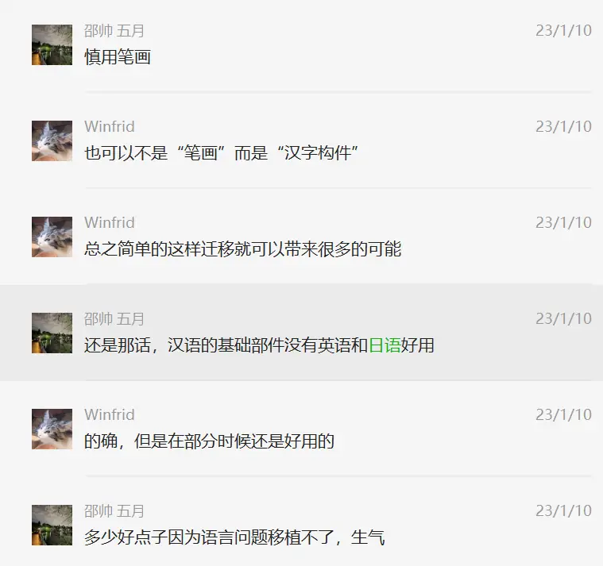

# 中文答案

:::info
这篇文章是有关谜题活动 P&KU2（pkupuzzle.art）的中文谜题的。本文包含了 P&KU2 的重要剧透，请谨慎观看。

本文存在许多不够严谨的断言、未经考证的假说、片面的一家之辞。

本文由 Winfrid 作于 2023 年 5 月 9 日。
:::

中文使用者天生是善于使用中文作为谜题的答案的，只是在 puzzle hunt 的特殊语境下，此前的制作者们还没有回想起“中文答案”这个东西的存在。
紧接着随之而来的几个问题则是：**中文答案的谜题在创作上和英文答案有什么区别？为什么要用中文答案？应该选用什么中文答案？**

归根结底，它们的答案中，最重要的内容都是相同的，也即“提取逻辑的重构”。

## 中文答案的谜题在创作上和英文答案有什么区别？

答案从英文转为中文，其难点的核心在于**提取逻辑**的转变。为了更好地理解这一点，我们不妨从觅月区的英文答案谜题入手，看看英文答案提取技法能否迁移到中文答案上。

英文答案最为常见的提取技法，是 **“从若干短语/单词中各自抽出一个或数个字母，拼接成答案”**，这里探讨的这一概念包括了：

- 用数进行 index（参见《此题有私货夹带》、《Meta：春风衔笺》的绿）
- 提取出特征位点的字母（参见《Meta：春风衔笺》的蓝、黄）
- 直接指示出需要提取的位点（参见《即兴》、《Meta：冬》）
- 用 transadd 等文字游戏技巧得到需要的字母
- 通过字母组合和其它事物的对应，来建立字母与某种内容的一一对应（参见《造字是门化繁为简的艺术》）

但是，单词 → 字母，在中文语境下应该是什么呢？汉字应该在箭头的哪一侧呢？

- 如果放在箭头的左侧，那么箭头右侧应该是更小的构件，比如笔画、拼音、编码方案下的数字字母。
- 例如《解谜要在画画后》的**“汉字 → 笔画”**——但紧接着的问题在于，从笔画合在一起拼凑出汉字的这个过程，比起字母拼出单词的过程显然更不自然。这个过程对多数人而言太依赖笔画输入法等本不应该用到的工具了，而且因为 nutrimatic 这种生态位的工具的缺失，容错率也更低。
- 又如《芈雨的雨与米的谜语》的**“汉字 → 声韵母”**的反切技巧——这样的问题在于，拼音指向汉字是一对多的过程，实际上是需要玩家去猜测得到的汉字是什么，因此容错率也有所衰退。
- **“汉字 → 字形构件”**，没有通俗的标准可言，因此也不够好。
- **“汉字 = 五笔/电码等编码 → 数字/字母”**，把数字和字母组合成汉字尚还可以接受，但把汉字按编码拆解的这一步，简直完全蹂躏了汉字本身的美感。
- 如果放在箭头的右侧，那么箭头左侧应该是由汉字组成的内容，比如成语、短语、诗句。
- 实际上，这点已经能够比较成功地实现了。例如《古筝行动》里的“四字短语 → 汉字”、以及《书虫的进化》《未知音频》《合格的灯谜》里的处理。
- 纵然已经非常优秀，但在迁移的过程中，很多时候这个思路也并不能完全适用于中文语境。比如倘若要进行 wordplay，英文可以很轻松地用“pear - pearl”提取出“l”，但中文很难找到更多的比如“明治 → 三明治”得到“三”的东西。而这是因为汉字本身的表义性质决定的。

简要来说，这种提取技法在中文答案里行不通的原因在于，汉字向下追寻很难找到比字母更合适的结构，而汉字向上扩展又会因为汉字本身的表义属性而受限。

除此之外，就更不必说其它**数字转字母**的技法了（乃至三进制、二进制、ASCII、盲文、旗语），它们更加无法在汉字上实现。而如果使用了五笔、电码、汉字盲文、二十三声二十四韵等编码方案，它们都不是一个耳熟能详到可以作为 puzzle hunt 里共同的预设知识存在的内容。

那么，更加适合中文答案使用的，除了刚刚的从更大的内容里提取，剩下的就恰恰是英文答案的谜题里小众的提取技巧，例如《写真一言》最后的 **task**，《破碎的竹简》《做题别买盗版书》《明信片》《便签纸》《猫》《寻箭》的直接**从汉字墙上得到答案**，或者《月照纱窗》《万古大魔法书》那样直接以**汉字之间的关系提取**，以及**象形**。甚至象形，也有多种选择，可以选择是把汉字视作像素图形（《字帖》），还是视作若干线段组成的图案（《雕刻艺术》），又或者是其它几何图形的组合。

## 为什么要用中文答案？

解决了刚刚的问题，这个问题也就好回答了——之所以用中文答案，是因为想要把更多的中文题材放置进 P&KU2。

**可以说，正是因为提取逻辑的演绎，才让中文答案的芈雨区比觅月区更急切地呼唤着中文题材。**毕竟只有中文题材才能够得到中文短语或诗句以提取汉字，也只有中文题材才能够让汉字墙不显得突兀，同时也只有中文题材才能够自然地引出汉字间的关系。这不是一种可以选择的事项，而是中文答案决定的必然结果。

中文答案提取逻辑的不同，让中文答案的谜题更加需要中文题材。**也因此，为了让中文题材自然地融入谜题，中文答案就有着天然的优势。**

- 基于汉字的题材自然不必多言。比如《万古大魔法书》这样的内容就极其难以提取出英文答案；而尝试性地提取出英文答案的《解谜要在画画后》的最后一步是 task，并不是非常优秀的提取；MITMH2021 的 Radical Rebuses 是一道非常优秀的中文谜题，但是其最后一步是翻译成英文，这就使得这种提取很难具备可推广的价值。
- 基于汉语流行文化的题材，如果要引入英文答案，那么一种可能是拼音，另一种可能则是翻译。但这两者或者不够自然，或者不够准确。

而目前已经出现的基于汉字、中国文化的英语答案谜题，其中的大多数与其说是“汉语”谜题，更不如说这些谜题是**使用了中文作为谜题素材的英语题**。它们固然可行，但无法覆盖全部的中文题材。

## 应该选用什么中文答案？

如大家所见，P&KU2 全部选用了古诗词句作为答案。相比于平凡的中文短语，这样的安排一方面是为了 final meta 更好地服务，另一方面也能够提供更高的容错率（毕竟很多答案只靠两三个字就可以做出）。但是对于出题者而言，这就让凑答案变得更加费劲了。

为了解谜者的做题体验，可能最后比较适合的答案还是设置成各种文集里已有的句子、俗语、谚语、歇后语、诗词、成语或词语比较好吧？

> 这又是一篇本来想详细地写好但是囿于自己的知识所限而最后匆匆束尾的文章。总的而言，中文答案是 P&KU2 出题组永远在讨论的话题，而每次讨论完，大家都会感慨日本的谜题发展极其发达不是没有道理的——一方面有汉字可以用中文里所用的提取方式、一方面有罗马音而可以用字母的提取方式、又同时有着五十音图这样的“字母表”，这种优势用得天独厚来形容也不为过。而我们也尝试着去参考一些英文 hunt 的 emoji 答案是如何提取的，但最后发现那些题目的提取更像是一道英文题目最后缝了一层英文转 emoji 或是象形，极其令人遗憾。实际上，还是中文本土的创作者的作品于我们而言的借鉴意义更多一些。
