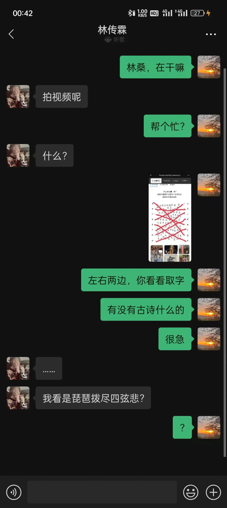
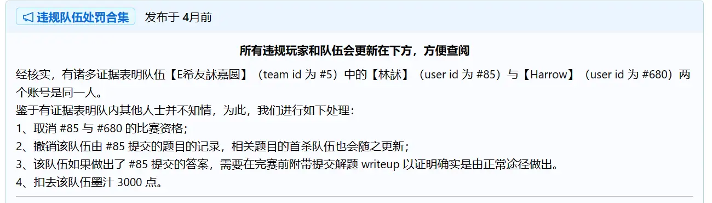
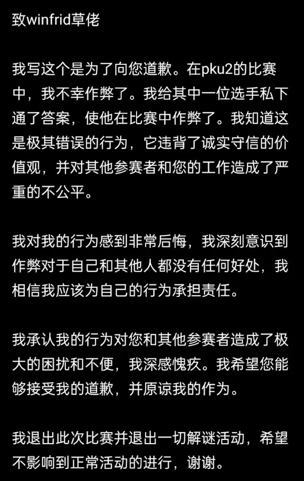

# 相关梗

## 琵琶拨尽四弦悲

在 P&KU2 里有一道名为[《写真一言》](../solutions/01-mi-yu-qu/16-xie-zhen-yi-yan.mdx)的谜题。这道题需要玩家先通过一系列简单的操作得到 “制作一个写真一言发至站内信” 的指令。
而玩家真的制作了这么一个图之后，就可以从 staff 那里得到答案 **“琵琶拨尽四弦悲”**。

**多年以后，面对通灵者，《写真一言》将会回想起 Winfrid 把它编写出来的那个遥远的下午。**

在 P&KU2 开赛的第一天晚上，P&KU2 的技术总监 kinami 等一众 staff 为了寻求乐子，而开始收集每个队伍提交的写真一言。
而殊不知，更有趣的事情即将发生：大家很快发现，【E希友訹嘉圆】 队伍居然在没有给 staff 发站内信的情况下就已经做出了这道题的答案！

俗话说得好，智者乐水，仁者乐山，超级侦探，认真办案。因此，闲得发慌的 staff 们为了守护 P&KU 的公平，也为了保障正常做题的选手们的出体体验，
开始了轰轰烈烈的调查。五月老师从 E希友訹嘉圆 队伍里了解到提交者后，即刻展开了问询。

调查结果显示，这一队的《写真一言》是由队伍里的林訹老师提交的答案。于是，staff 中的五月进行了逼问，也由是诞生出 P&KU2 最知名的那句梗——

于是，这张疑似展现了拥有两个微信账号这一特殊能力的图片，连同上面的 **“我看是琵琶拨尽四弦悲？”** 同时成为了 P&KU2 在第一天就拥有的巨型名言。

这还不是这一戏剧性故事的至高点。kinami 随后突然发现，这位林訹居然与另一个 P&KU2 的账号 “Harrow” 在各种痕迹上又有着极为惊人的一致性！而后者，
居然是 P&KU2 的内测人员 “落风” 的 staff 账号……

知道了这一点的 Winfrid 突然自发地将脑海的全部事情组合在了一起：这位 “落风” 老师在 2022 年 9 月就想要加入内测组，而他在内测中一直在全程划水，
划水到了如今这样连《写真一言》这题的提取方式都不理解。就像是万物都有属于自己的答案一样，冥冥之中，所有的造化的旨意都在那一刻尘埃落定。

于是，落风老师立刻被大家请出了各类 staff 权限有关的地方。

经过一番处理后，毫不知情的做题者们见到了如下公告——

一切的史诗凝聚在文字上都是那么地默然无声，但玩家们还是能够从中见到属于 P&KU2 独属的那份，波澜壮阔。

最后，落风老师在 Winfrid 的建议下，写了一封道歉信。苍毫纵千里，落笔即文章。这封告退解谜圈的绝笔之作后来被检定与 ChatGPT 有着超过 99% 的相似度，
其中的 **“我不幸作弊了”** 也成为了千古绝句。 后世的语言学家将这个句子与 “王冕死了父亲” 并称为 “困扰在
21世纪汉语学家头顶的两片乌云”。

不太有人能记得 P&KU2 的每道题是什么，也不太有人会想起 P&KU2 的排行上的各题的名字，但大家永远都会记住落风。

希望大家为了队友与对手们的体验，更为了自己的体验，不要再作弊了。

> 注：这支队伍【E希友訹嘉圆】后来更名为了【E希友嘉圆】。
