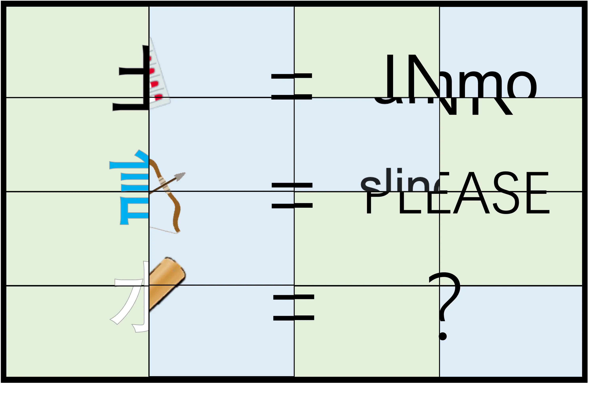
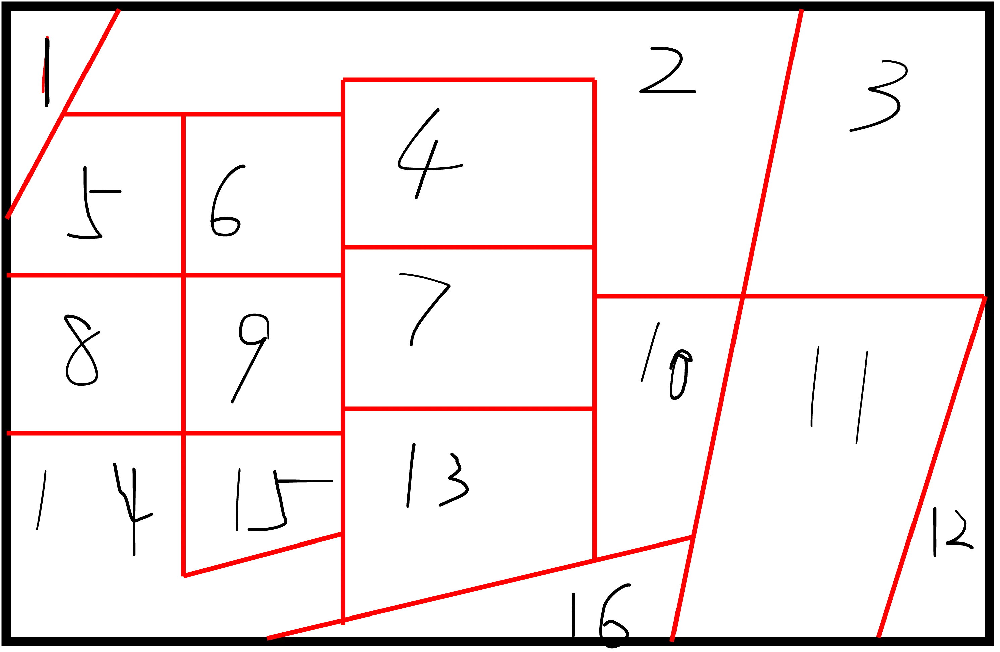
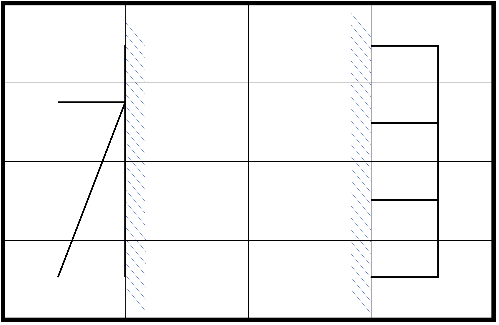

# 谜兜众筹模式

## 题面

:::info
[P&KU2：谜兜众筹模式](https://pnku2.pkupuzzle.art/#/game/miyu/prob_03)
:::

_终于，选择的权利降临到了每个人的手里。_

_就算一切徒劳无功，就算结果不过如此，_

_我仍然选择我自己认为最好的决定！_

真相已逐渐揭开全貌，投票将不再进行。维系着、束缚着这一切的规则，见于此页之末。

- **你可以** [下载详细规则](https://pnku2.pkupuzzle.art/media/miyu/103_prob_03_MDZCMS/MDZCMS_Rule.pdf)

## 答案

<AnswerBlock>三春负锄相识</AnswerBlock>

## 解析

如这道题最后附带的规则文件所言，本题是一道随着时间变化的题目。有六个小题，每个小题的题面被分为 16 个格子，
而 Hunt 最开始只揭露出其中的 4 个，每 12 个小时会有新的格子翻出，而每次玩家需要进行公投来决定下一个翻的是什么格子。
所以，玩家需要自行推断哪个格子里隐藏的可能是对自己进一步解题更有利的信息。

顺带一提，这道题的玩法基于[特级山芋的谜兜 HIDDLE 产品](https://mp.weixin.qq.com/s?__biz=Mzk0MjM4Njg1Mw==&mid=2247483748&idx=1&sn=b6046a04b94e1bc70c6e8b1441401c66&chksm=c2c2baaef5b533b8f7b5c3a63498440b64c1ccfe99d856766a4d43a7bceeab79803a66dfbff8&scene=126&sessionid=1683845192&key=d13f9088f4a015db636e3fb98d91b47160bd81f0963e0c4e7551f63457df3dfc2236238bb7149d41dfbda39a8b3ded18b0be260698dd1a3188c5b7a2fae1b84eaac847b65d783954bbc3efcf5c879b7bb5fcdac2d4654b2ad357f3c912374d7bcbb95f6729415ad25a4ba0adaf9dbc5592741b118757f6c876b3c53e14e769ca&ascene=1&uin=Mjc0MjI3NDAzMg%3D%3D&devicetype=Windows+10+x64&version=6300002f&lang=zh_CN&countrycode=CN&exportkey=n_ChQIAhIQO3ei%2Bda6j5lA3jsPjkcM1xL0AQIE97dBBAEAAAAAAOHSJTc%2B5tMAAAAOpnltbLcz9gKNyK89dVj0QYb%2FVfOKCTqKg7wEK6FvclH%2BtF16WdZMdx7bhrCbEMxNVenpxYTMhnT5NqBQp4eS78uQK%2Bl8mC5A0%2BmBWiRXWu%2F32r64gKcbWTctIIp7IYrJ%2Fl%2BIDPiGqt8726xRSngEcNVqNPWwt6ogbuywRUETiAm3RsTZj56zrI0D1weuT6XbDKwblXC4P3OylwVMUmG7QObFa2SyA05q3%2BiCIf1pdnvqklfFaaP18HVA2TZGvZYtMppi9caK2ZRG%2FKRLQnTCo3l7s5NVYYp6OVBvqUs%3D&acctmode=0&pass_ticket=x0wV7OK9v%2F60e9l5wqI%2FyZJWeRahuRsl4uG4HRDx%2BGHPYnuh5bR6bJJ34VNuColj77oLZdfMbmSKjkBU23Gbyg%3D%3D&wx_header=0)。

> 这里除了配备每道题的解析外，同时还给出了每道题在最开始的**理论**解题途径。这些解题途径仅仅是理论上的（事实上，由于芈雨区的答案都是古文，所以整道题的答案在最初是可解的）。不过，除了第三个子谜题之外，其它的子谜题的确在最开始的时候就已经被有的队伍解出了。

### 子谜题1

题目完全揭露出来的样貌如上图所示。指南针很明显是暗示了东南西北四个方位，而它们的单词字母数量也正好与方格数一致。
把英文字母填入对应格子，就会意识到 1/5 之类的是指答案里五个字母的单词的第一个字母。于是提取出单词 THREE，也就是 **“三”**。

> 在最开始，给出了第 3、9、10、12 格。

> **这个子谜题在最开始是可解的：**  
> 可以通过漏出的四分之一个指南针的符号推测出本题和四个方位有关，然后紧接着通过已经翻开的格子来猜测出整体格子的排版，以确认每个方位各有几个格子，从而就可以意识到格子数量和对应的单词长度一致。最后，已经翻开了 1/5、2/5、3/5，并且可以找到 WEST 的 E 是 4/5 或者 5/5。所以不难得到答案。

### 子谜题2

题目完全揭露出来的样貌如上图所示。

**本题由重合的蓝色和绿色两道题板构成，第奇数次翻出的是对应位置的蓝色题板，第偶数次翻出的是对应位置的绿色题板。**
（最终样貌里绿色题板更多，是因为第奇数次投票的时候两个绿色题板平票，导致两者都被翻开）

- 绿色题板：黑色的土=墨=INK，青色的言=請=PLEASE，所以白色的水=泉=SPRING
- 蓝色题板：药→弹药=ammo，弓→弹弓=slingshot，簧→弹簧=spring

两个题板的答案都是 spring，不过一个是泉，一个是弹簧。最后这道题的答案取的是 spring 的第三个义项 **“春”**。

> 在最开始，给出了第 4、6、9、12 格。

> **这个子谜题在最开始是可解的：**  
> 可以通过第四格漏出的“mmo”推测出单词是“ammo”，从而能和第六格的药一同让人了解蓝色题板的规则是加一个“弹”。而第六格的弓也暗示了这一点。从而蓝色如果有问号，那么答案应该是一个含有“弹”的词的英文。然后，可以通过第十二格的“EASE”推测出单词是“PLEASE”，从而猜到第九格的青色的字的一角是青色的“言”，从而推理出绿色题板的机制。那么，第九格白色的“水”的对应的当然就是“泉”，也就是 SPRING。这时候能够猜出蓝色题板的答案可能也是 spring（“弹簧”），从而进一步猜出答案是“春”（spring）。

### 子谜题3

题目完全揭露出来的样貌如上图所示。

本题得到的是一句乱序的话。值得一提的是，**这道题每个格子的编号是根据这个字在句子里的实际位置编号的**，
从而在投票界面能够发现貌似格子的编号排错了。但如果能够看出格子编号排错，那么在理解这一点的原因之后，这个细节就能够更好地帮助连词成句。

完整的句子是“什么汉字同时是正以及胜的反义词”，答案为\*\*“负”\*\*。

> 在最开始，给出了“么”“正”“词”“胜”，并且投票界面标注的已翻开格子是“2”“8”“12”“16”。

> **这个子谜题在最开始是理论可解的（仅仅是理论）：**  
> 按直觉而言，这四个格子是 2、8、13、16，但是标注的是 2、8、12、16，甚至通过站内信确认之后题面也没有修正，那么就可以意识到有另一个更强的规则束缚着顺序。所以能够猜出实际的编号是这个字在句子里的位置。但这一点对最初的题面帮助不大，只能够在后续翻格子的过程中确认新翻出来的字在句子里的位置。如果能够注意到“正”和“胜”的反义词都是“负”的话，就可以解出答案，或者可以在爆破出整句古文答案后加以验证。

### 子谜题4

题目完全揭露出来的样貌如上图所示。

**这道题明显是一个“不规则格子”的规则变种，并且答案正好是格子的边缘组成的字。在还没有揭开全部题板之前是没有这些红线和数字的，但可以从未开出的格子的轮廓推测出字的结构。答案是“锄”**。

> 在最开始，给出了第 1、2、9、14 格。

> **这个子谜题在最开始是可解的：**  
> 从 2、9、14 的边缘可以看出字的左侧有一个金字旁，因此检索金字旁的常用字，可以发现“锄”是符合的。

### 子谜题5

题目完全揭露出来的样貌如上图所示。

斜线在物理中代表着镜面，所以可以得到 **“相”**。

> 在最开始，给出了第 4、5、10、12 格。

> **这个子谜题在最开始显然是可解的：**  
> 从第 10 格垂直的镜面标记可以很轻松地意识到第二列应该都是镜面标记，从而很快地可以确认左侧是木字旁。同时也可以大胆猜测右边也是一个左右对称的结构（不猜测也没关系），从而可以联系已经揭露的部分猜出右边是个“目”。

### 子谜题6

题目完全揭露出来的样貌如上图所示。

整道题的逻辑是，对角线上的两个字可以与中心圆圈组成一个三字词语：

- 左上角是“知”（未知数、贺知章）
- 右上角是“意”（注意力、示意图）
- 左下角是“流”（交流电、平流层）
- 右下角是“点”（钟点工、早点铺）

最后对小圆圈再次组词，得到大圆圈是 **“识”**（知识点、意识流）。

> 在最开始，给出了第 2、5、13、14 格（贺、章、层、电）。

> **这个子谜题在最开始是可解的：**  
> 可以看出“贺知章”，从而不仅意识到整道题的机理，也可以知道左上角是“知”。接着可以搜索第三个字是“层”和“电”的三字词，或者凭借语感，从而确认左下角是“流”。然后，通过对于谜题的感知能力，能够意识到整道题的结构应该是 16 个字组成 4 个字之后，最后再迭代一下得到最终的 1 个字。从而答案“?“需要满足”X?流“和”知?X“。凭借搜索或语感可以得到答案。

因此，最后的答案是 **“三春负锄相识”**。

## 作者

五月（设计与美工）

## 附言

### 五月

在 P&KU2 中，我们有五十余个小题，可以去探索各种不同的可能性。**“随时间变化的谜题”，这就是 Winfrid 定下的小任务之一。**
我首先想到的是謎解き日本一決定戦半决赛时候的一题。简单来说，题目会随时间逐渐展示，并且其实在非常早期的时候，题目就可以解答了。

好，先把这个讨论放一下，说另一个小任务。

五月与 Winfrid，都是深度参与谜兜 HIDDLE 的创作中的，那我们要不要在 P&KU2 中放一道 HIDDLE 题呢？

我们觉得可以。但是我们认为应该进一步挖掘 HIDDLE 的遮挡产生的意义。比如说，当题目被遮挡了一半，那是不是答案也要除以二——当然这个角度后来没有使用。

总之，我们认为 HIDDLE 的遮挡是一件很有魔力的事情，它能做到的应当不仅仅是让题目变得更难一些。

偶然地，我们突然想到上面这两个小任务是可以合并的！并且 Winfrid 提出可以通过投票的方式，让玩家参与进 HIDDLE 题目揭示的过程。
这非常符合我对 P&KU2 这个活动的构想——**能让更多玩家，获得“解开题目答案”之外的快乐。**

后续的内容就变得简单且理所当然了。很明显，我需要出若干题，每题的答案都是一个汉字（或者起码能翻译成一个汉字），这些题目应该是非常非常简单的，且理论上可以在翻开四块时做出来。
在我写这段文字时比赛还没有开始，我不知道这个“理论”是否能够得到全体玩家的证实。

我抱着一颗希望有人灵光一现能做出来却又希望 HIDDLE 翻格子的环节能多持续几天的心情，期待着大家的实际体验。

在创作中，我们也有意识的复活了或者加强了一些之前 HIDDLE 直播中使用过的效果非常好的点子（感谢@爻提供的“锄”题的点子的原型），
希望能让更多的人了解这些点子的有趣之处。

### Winfrid

这道题虽然只是芈雨区的第三题（不过也的确是特意安排在这个位置的），但其实包含了我对于谜题本身一些特质的理解。

1. 我很看重 **“时间”** 在 puzzle hunt 里的地位。
但和 gph2022 把“时间”视作一种题材或是机制不同，我更注重于思考“时间”对解谜者体验带来的变化。
由于提示系统的存在，puzzle hunt 里的谜题难度会随着时间而变简单。但是我试图用 HIDDLE 的手段，来绕开提示系统，让谜题难度天然地会随着时间变化。
可以说总体上这个点子最后的实施还是比较让人满意的——顺带一提，《时之浊影》是这个点子在更窄的时间尺度上的覆写。
甚至，“锄”那道题，题面本身甚至是随着时间而越来越难的。

2. 另外一个一直我希望强调的点在于 **互动性**。只要有一个人吐槽了“别的队伍投的都是什么鬼玩意”，或许就成功了吧？

3. 此外，**“信息”** 这个点也是非常诱人的。在謎解き日本一決定戦里，你不仅需要做出题目，而且还需要在题目没报完的时候在别人之前更快地做出题目。所以尽管整个题目在信息提供完之后是可做的，但是你需要提前挖掘已经泄露出的蛛丝马迹以推测题目会问什么。这一点非常有趣，但是在普通的 hunt 题里很难实现——而 hiddle 提供了这种思路的一个实现途径。

### 生煎

这是一个有 Hiddle、谜题赛和关于时间的点子，而现在它们是在形式上、而不是内容上地融合了，这种选择也体现了 Winfrid 创作里的“追问”。
我认为应该在肯定了上述内容之后，才适合具体讨论这道题在实现上的优缺点。

觉得最终效果不够好的地方是，原 Hiddle 游戏里解题就是推进比赛本身，
但 P&KU2 里推进比赛反而可以来买这题的提示或者反爆，正向解决这题的意愿比不过按天数拖长战线的折磨。

觉得好的地方有：Hiddle 和谜题赛在机制上的很多吻合被找到了，很巧妙；选手互动这个想法总是很吸引我，有种热热闹闹氛围很好的感觉；
今天尝试新的形式，明天说不定就有新游戏能流传下来，是一件非常好的事情。
