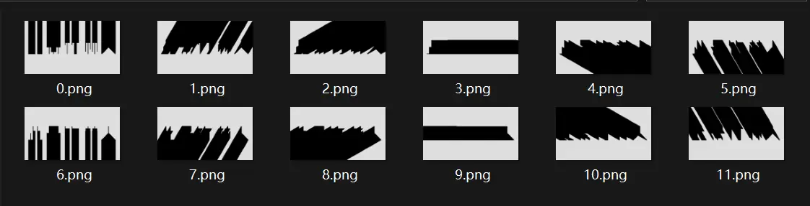

# 时之浊影

## 题面

:::info
[P&KU2：时之浊影](https://pnku2.pkupuzzle.art/#/game/miyu/prob_12)
:::

_时间会给你答案。_

> 题面是如下图片：https://pnku2.pkupuzzle.art/media/miyu/112_prob_12_SZZY/SZZY_Image_X.png  
> （X 为 0-11 的整数）

## 答案

<AnswerBlock>此景竹林人</AnswerBlock>

## 解析

“时间会给你答案”。遵循着这句指示，我们会发现题面的图片在不同的时刻是不一样的！实际上，题面每五分钟变化一次，十二次一个周期，而当下时刻的图片是答案 **“此景竹林人”** 在对应分针方向上的影子。

## 作者

榆木华（设计与美工）；kinami（网页部署）

## 附言

### 榆木华

是在学 PV 时玩红巨星 LongShadow 的时候不经意想到的点子：如果这个阴影拉长到屏幕外面的话看起来会很酷。以及当时群里好像就在讨论变化的谜题的事情，于是就拿去实践了一下，视觉效果确实挺酷的。

要是能多加几个方块让大家可以多盯一会就好了，现在感觉就是全员秒掉的状态。

### 生煎

成分为纯 idea 的题，放在那里就很可爱。如果 “卧槽是字” 的感叹能稍微按一按再令人发出来就更好了。
