# 我的朋友在哪里

## 题面

:::info
[P&KU2：我的朋友在哪里](https://pnku2.pkupuzzle.art/#/game/miyu/prob_18)
:::

_在这里在这里，我的朋友在这里。_

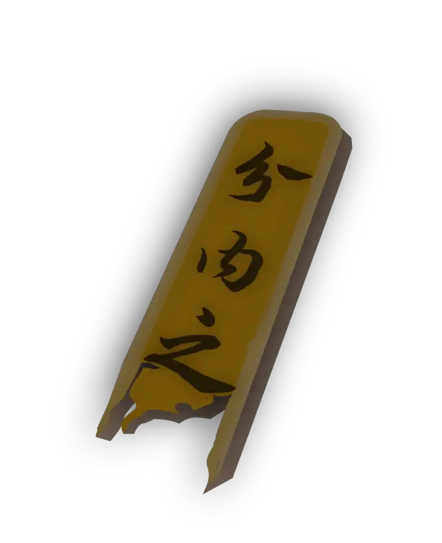

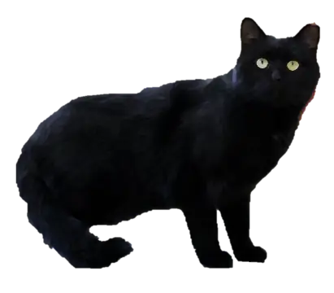

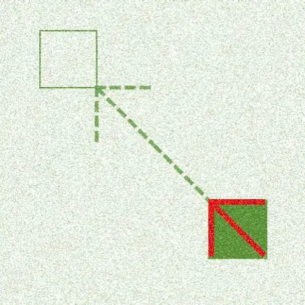

_纸薄也就算了，我要看的倒是挡的严严实实！_

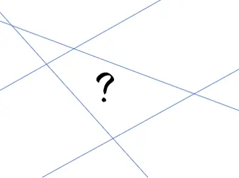

## 答案

穷谷晞阳犹未春

## 解析

题目里有七段素材，而且每段素材显然是对于之前的某个小题的一个 callback：

1.  《谜兜众筹模式》第六块题板的揭开顺序。标红的第1格为“**未**”。（值得一提，本题的此图也随着谜兜众筹模式而同步更新）

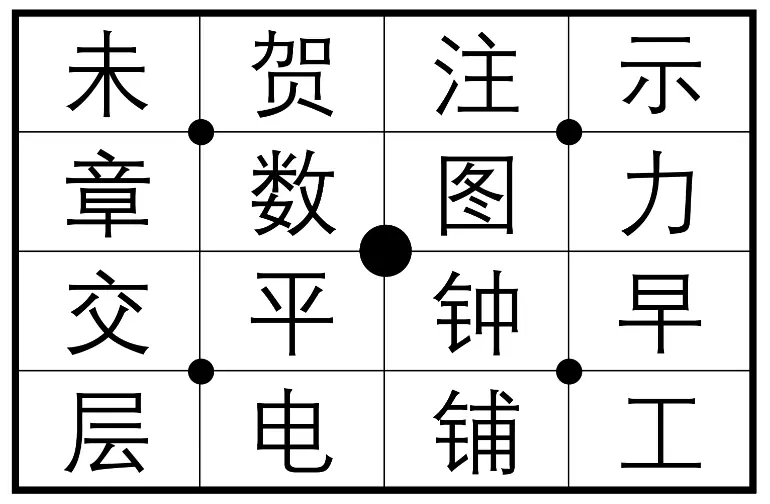

2.  《破碎的竹简》，“分内之?”，因此按照原题里找成语的方式，找到“八”和“刀”中间的字，是“**犹**”。

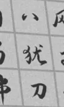

3.  《猫》，这里的图是茶叶蛋，于是找到原题里茶叶蛋对应的字，是“**穷**”。

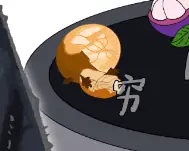

4.  《寻箭》，找到原题里 1×1 绿色格子左上方隔两格的字，是“**谷**”。

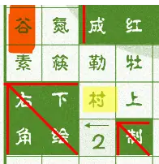

5.  《做题别买盗版书》，根据这句话，找到原题里每页都是黑色的位置，得到“江潮水连海平缺了一个字是”，也就是“**春**”。

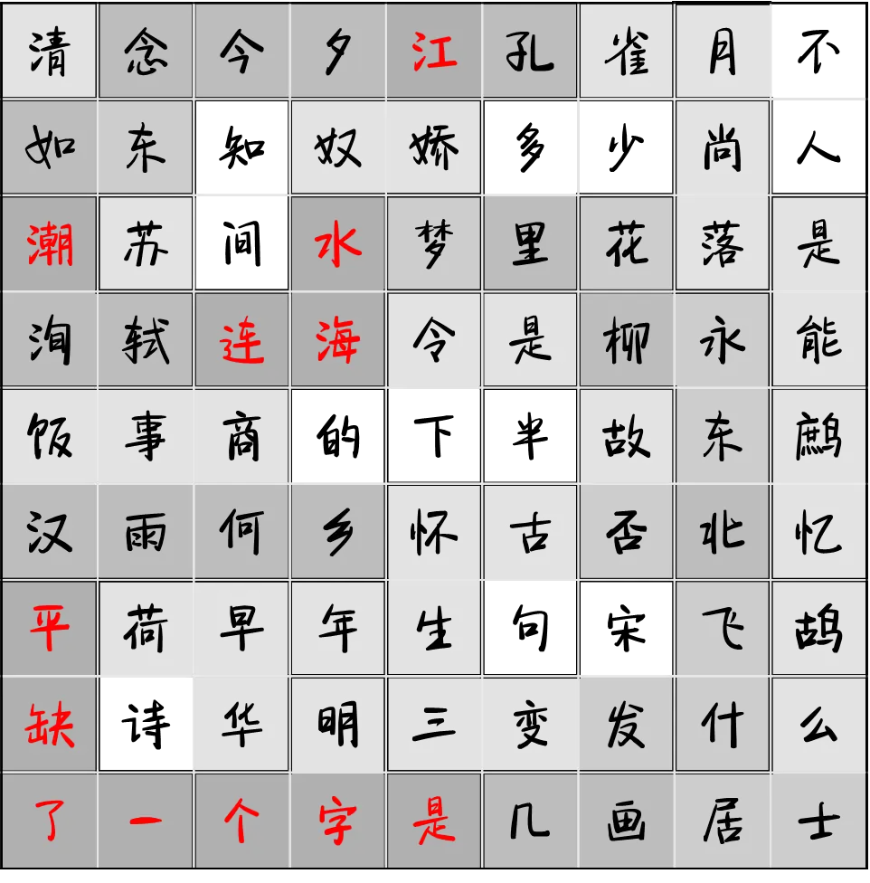

6.  《写真一言》，连线后找到如图的形状，里面的字是“**阳**”。

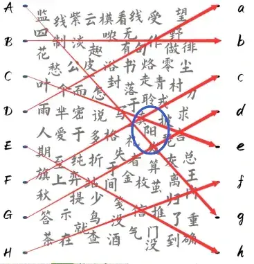

7.  《明信片》，找到如图所述的两个位置的字，“日”和“希”，合在一起得到“**晞**”。

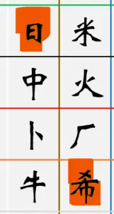

最后，不难发现其实这七段素材是按照题目呈现顺序给出的（因此原顺序没有意义）。而《我的朋友在哪里》是一首儿歌，题目文案“_在这里在这里，我的朋友在这里。_”也暗示了这一点。这首歌里，“我的朋友在哪里”的前一句是“一二三四五六七”，同时这七道被 callback 的题的标题长度也遍历了一二三四五六七。

于是按照此顺序重新排列，得到答案“**穷谷晞阳犹未春**”。

## 作者

五月（设计）；Winfrid（美工）

## 附言

### 五月

就是想出一个平常在日谜中常见 hunt 中少有的“中谜”，不是一般意义上使用相关小题答案的 meta，而是对相关题目进行重新利用的 callback。 在我的理解里，Callback 有两种：第一种是使用题面作为素材，但使用新的方式得到答案；第二种是使用原题目的知识，但在新的地方得到答案。有意的没有混用这两种手法。
