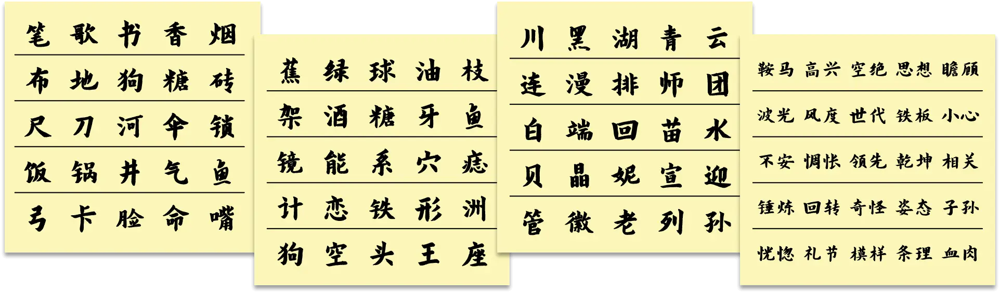

# 便签纸

## 题面

:::info
[P&KU2：便签纸](https://pnku2.pkupuzzle.art/#/game/miyu/prob_24)
:::

_似乎是写了奇怪的东西的便签纸。_

## 答案

<AnswerBlock>书空漫惆怅</AnswerBlock>

## 解析

这里一共有四个便签，每个便签有五行，共二十行。而每行都有五个字词，我们可以先观察每行的五个字词，发现其中的玄机：每行都有一个字词是异类！而每个便签纸挑出五个异类后，又可以推出这五个中的异类。因此，每个便签纸可以提取出一个字词。值得一提的是，每张便签纸所有的找异类过程都是遵循同一个主题的。

（同时，便签纸本身的排列顺序，行内部与行间都是按照拼音序排列的，所以其实顺序没有意义。）

- 第一张便签纸和量词有关。所有字都是可数名词，而每一组五个字里的四个都可以用同一个量词修饰。
- 一支笔、一支歌、一支香、一支烟。**书**是异类。
- 一块布、一块地、一块糖、一块砖。**狗**是异类。
- 一把尺、一把刀、一把伞、一把锁。**河**是异类。
- 一口饭、一口锅、一口井、一口气。**鱼**是异类。
- 一张弓、一张卡、一张脸、一张嘴。**命**是异类。
- 一条狗、一条河、一条鱼、一条命。**书**是异类中的异类。
- 第二张便签纸和组词有关。每一组五个字里的四个都可以在前面添加相同的词来形成一个三字词。
- 橄榄绿、橄榄球、橄榄油、橄榄枝。**蕉**是异类。
- 葡萄架、葡萄酒、葡萄糖、葡萄牙。**鱼**是异类。
- 太阳镜、太阳能、太阳系、太阳穴。**痣**是异类。
- 三角恋、三角铁、三角形、三角洲。**计**是异类。
- 狮子狗、狮子头、狮子王、狮子座。**空**是异类。
- 美人蕉、美人鱼、美人痣、美人计。**空**是异类中的异类。
- 第三张便签纸和字义有关。每一组的五个字里面的四个都属于同一集合。
- 川、黑、青、云都是省级行政区简称。**湖**是异类。
- 连、排、师、团都是我国军队编制分级。**漫**是异类。
- 白、回、苗、水都是我国民族名称。**端**是异类。
- 贝、晶、妮、迎都是2008北京奥运会的吉祥物。**宣**是异类。
- 管、老、列、孙都是诸子百家之一。**徽**是异类。
- 宣、徽、湖、端分别是文房四宝的产地。**漫**是异类中的异类。
- 第四张便签纸和成语构词有关。每一组的五个词里面的四个都可以用某种方式形成成语。
- 鞍前马后、空前绝后、思前想后、瞻前顾后。**高兴**是异类。
- 波光粼粼、风度翩翩、铁板钉钉、小心翼翼。**世代**是异类。
- 惴惴不安、遥遥领先、朗朗乾坤、息息相关。**惆怅**是异类。
- 千锤百炼、千回百转、千奇百怪、千姿百态。**子孙**是异类。
- 有礼有节、有模有样、有条有理、有血有肉。**恍惚**是异类。
- 高高兴兴、世世代代、子子孙孙、恍恍惚惚。**惆怅**是异类中的异类。

所以，答案是四个异类中的异类拼起来的句子：**“书空漫惆怅”**。

## 作者

Winfrid（设计与美工）

## 附言

### Winfrid

关于汉字题材，其实很多时候并不是刻意想要贪多，只是中文答案的提取逻辑倒逼谜题设计需要考虑汉字的存在。更多内容可以在有关的[设计手稿](../../03-she-ji-shou-gao/02-zhong-wen-da-an.mdx)里查看。

当然，这道题确实也有穷兵黩武的一点想法，试图想把那些想过要出但最终没出出来的点子编织成一个 problem set，如同 P&KU2 的最后一舞。结果，大家最后只通过后面两张便签纸就能爆破出答案，还是比较遗憾的。

这道题极少程度地参考了 teammate hunt 的 emoji 找不同题。和 emoji 不同的是，汉字的属性实在太多了，随便给五个不同的汉字，就能有五种不同的解读方式，告诉你哪个字是其中特殊的那个。——于是最后设计的方案是，每张便签纸的规则都是同一个 pattern。这点的确很有效。
