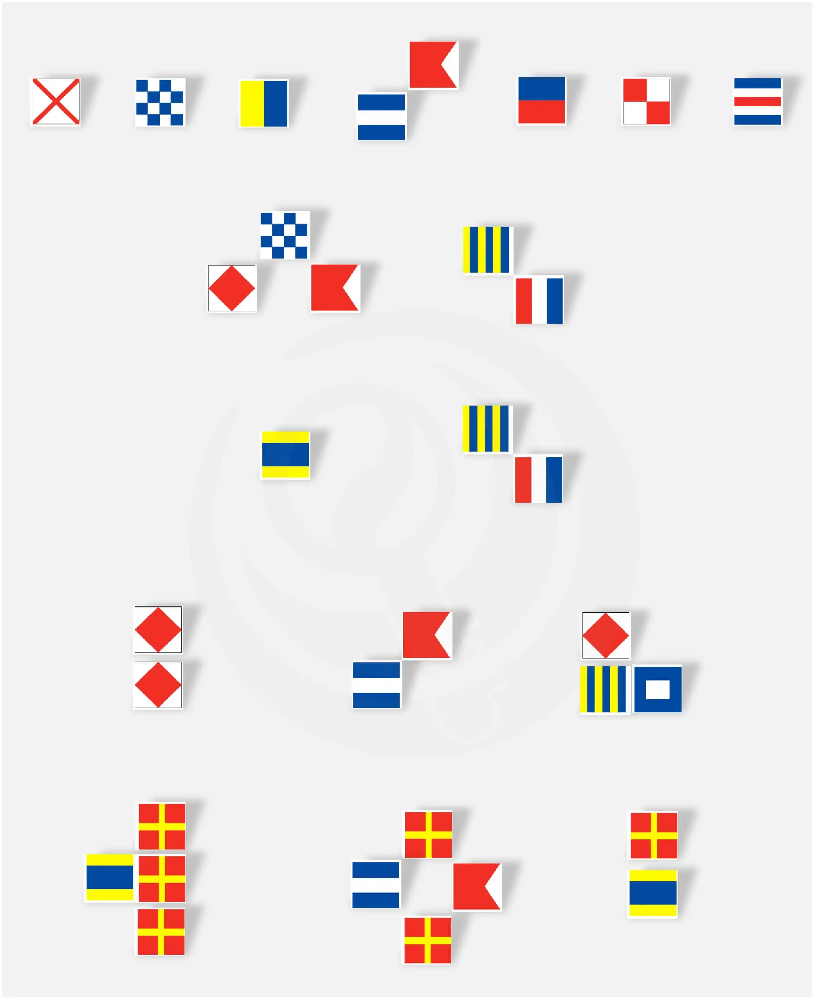

# 命题组的和睦无与伦比

## 题面

:::info
[P&KU2：命题组的和睦无与伦比](https://pnku2.pkupuzzle.art/#/game/miyue/winter_01)
:::

_“美工你怎么搞的我说的是这个旗子吗？！”_

_“你那草稿跟狗刨的似的我能看懂就不错了你凑合用吧！”_

## 答案

<AnswerBlock>WOMAN IN FOREST</AnswerBlock>

## 解析

根据文案的提示，首先把图中的信号旗变为字母，尝试将得到的字母在对应位置转换为双旗旗语。就可以得到象形了的答案。

## 作者

五月（设计与美工）

## 附言

### 五月

跟某外国 hunt 撞点子了，都是海军旗变旗语。不过我这个第二步虽然水，但起码挺自然的。

其实也考虑过在“旗子”上继续做文章，比如把国旗与海军旗的相似也加入题目中。但没搞出来。
