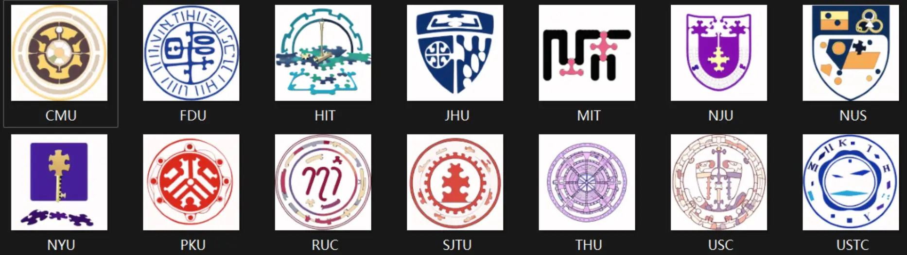

# 此题有私货夹带

## 题面

:::info
[P&KU2：此题有私货夹带](https://pnku2.pkupuzzle.art/#/game/miyue/winter_02)
:::

_有时候为 puzzle hunt 设计一个好的 logo 和一个响亮的名称是非常重要的。_
_但是征集得到的这些散乱的意见稿里，好像全都夹带着什么私货……_

    
点此查看完整题面

    > - 在这个系列的 puzzle hunt 里，芈雨和觅月会尝试在一个平行世界里设下陷阱困住、并捕猎独角兽，以发现潜藏在这个世界中的真相。[4]
    > - 在这个系列的 puzzle hunt 里，芈雨和觅月会尝试在一个平行世界里研究不同时期的不明飞行物，其中既包括古典的，也包括现代的。[14]
    > - 在这个系列的 puzzle hunt 里，芈雨和觅月会尝试在一个平行世界里面临一次测试，而这次考试内容居然是坚定的希望和迸发的灵感。[21]
    > - 在这个系列的 puzzle hunt 里，芈雨和觅月会尝试在一个平行世界里学习各类谜题影片与视频，因此她们会成为网飞和油管的使用者。[3]
    > - 在这个系列的 puzzle hunt 里，芈雨和觅月会尝试在一个平行世界里回顾自己已经触及到的力量与知识，以充分理解它们之中的精髓。[12]
    > - 在这个系列的 puzzle hunt 里，芈雨和觅月会尝试在一个平行世界里探索季节的奥秘，她们研究一切季节，无论它们是否已经被命名。[18]
    > - 在这个系列的 puzzle hunt 里，芈雨和觅月会尝试在一个平行世界里溯洄在密西西比河上，在这条河流及其支流中寻找着神秘的真相。[19]
    > - 在这个系列的 puzzle hunt 里，芈雨和觅月会尝试在一个平行世界里仰望星空，在看那些星星的同时，进行一场前往宇宙的悠长旅途。[10]
    > - 在这个系列的 puzzle hunt 里，芈雨和觅月会尝试在一个平行世界里观察奇妙的生物，这次是一些既珍稀罕见、又极不寻常的……猫。[13]
    > - 在这个系列的 puzzle hunt 里，芈雨和觅月会尝试在一个平行世界里品尝咖啡：请不要醒来再闻咖啡，而请宽衣解带，然后再闻咖啡。[3]
    > - 在这个系列的 puzzle hunt 里，芈雨和觅月会尝试在一个平行世界里相逢新的叫作贾斯汀的少年，除此之外，还有贾斯汀的一把雨伞。[5]
    > - 在这个系列的 puzzle hunt 里，芈雨和觅月会尝试在一个平行世界里更新着谜题，并且，这些更新都是在每年的十一月和一月进行的。[20]
    > - 在这个系列的 puzzle hunt 里，芈雨和觅月会尝试在一个平行世界里进行区域建设：在其中，既包括城市的建设，也包括郊区的建设。[12]
    > - 在这个系列的 puzzle hunt 里，芈雨和觅月会尝试在一个平行世界里品尝各种美食与饮料，甚至为此建立了一个关于吃喝的联盟组织。[13]

    
    
    
    
    
    
    
    
    
    
    
    
    
    

## 答案

<AnswerBlock>POSTWAR OEDIPUS</AnswerBlock>

## 解析

题目给出了 14 个 puzzle hunt 的 logo 设计、以及主题文案稿。但是题目中提到的“响亮的名称”，我们是并不知道的。

突破口在 logo 这里：不难看出这些设计的 logo 都是一些学校的校徽（或其它元素）的魔改（拼图钥匙化）版本。具体如下：

发现了这一点后，我们联想到本 hunt 的英文名称 Puzzle and Key Universe，除开 and 的三个词实际上就是以北京大学的缩写 PKU 作为首字母的一个词组。因此，既然投稿者想要夹带私货，那么除了**把谜题活动的 logo 做得近似于学校校徽之外，肯定也要让整个活动的名称的首字母暗合学校缩写**！

能够验证这一思路的一个细节在于，14个图标下面的括号里的数串（也就是 hunt 的名称里各个单词的字母数量），第二个数永远是3，正好对应上了“and”这个单词的字母数量。

但仅凭这一点还不足以确认 hunt 的名称。**我们还需要从上面散落的14个 hunt 主题来反推它们对应的名称**。值得一提的是，图标的顺序大致是按照学校首字母排列的，但事实上是按照 hunt 名称的字母表顺序排列的（两者并不完全一致）。那么，上面的14个主题介绍肯定就是最终的提取顺序了。

| 大学名称            | Hunt 缩写 | Hunt 全称（根据主题得到）       | Index | 提取 |
| ------------------- | --------- | ------------------------------- | ----- | ---- |
| 清华大学            | T&HU     | Trapping and Hunting Unicorns   | 4     | P    |
| 卡内基梅隆大学      | C&MU     | Classical and Modern UFOs       | 14    | O    |
| 哈尔滨工业大学      | H&IT     | Hope and Inspiration Test       | 21    | S    |
| 纽约大学            | N&YU     | Netflix and YouTube Users       | 3     | T    |
| 北京大学            | P&KU      | Power and Knowledge Understood  | 12    | W    |
| 新加坡国立大学      | N&US     | Named and Unnamed Seasons       | 18    | A    |
| 麻省理工学院        | M&IT     | Mississippi and Its Tributaries | 19    | R    |
| 上海交通大学        | S&JTU    | Stars and Journey To Universe   | 10    | O    |
| 人民大学            | R&UC     | Rare and Unique Cats            | 13    | E    |
| 中国科学技术大学    | U&STC    | Undress and Smell The Coffee    | 3     | D    |
| 约翰斯·霍普金斯大学 | J&HU     | Justin and His Umbrella         | 5     | I    |
| 南京大学            | N&JU     | November and January Updates    | 20    | P    |
| 南加州大学          | U&SC     | Urban and Suburban Construction | 12    | U    |
| 复旦大学            | F&DU     | Food and Drinks Union           | 13    | S    |

从而得到答案 **POSTWAR OEDIPUS**。

## 作者

Winfrid（设计与美工）

## 附言

### Winfrid

说到 P&KU 这个名字的来源，就想到了 2021 年的一个 9 月的傍晚，我突然意识到“PKU”里的 P 和 K 正好是 Puzzle 和 Key 的首字母……~~如此浑然天成，仿若北京大学原先就是谜题的耶路撒冷~~。而且当时想到 Universe 是想着“我们可以在第 0 季让一个人陷入沉睡，然后让后面所有的故事都在她的梦境宇宙里发生”的美好愿景。——所以就有了这个名字。

除此之外，在当时尚在公众号里的 P&KU0 中，宣发的大部分过程和活动进行的从头至尾都没有提到“P&KU”，而是让这四个字符作为 final meta 的答案出现。总之说了这么多，就是想说这个名称还是挺有渊源的。

而这道题的直接灵感来源来自于 P&KU 的 QQ 群里总是会在问“国内其它大学有没有类似的 puzzle hunt”，于是这时就有很多朋友虚构出一堆别的大学如果有 puzzle hunt 则可能会使用的名称（按照 P&KU 的命名格式）。

最后，为了让这道题稍显困难，但又给足信息，就采取了利用校徽（或其元素）来指引出学校列表的这种方式。一开始是打算用描述校徽的方法进行……后来想到之前有人用 Novel AI 制作过大学的人格化形象，因此就尝试着用 img2img 的方式来进行了魔改：除了校徽图片之外，还在喂给 Novel AI 的描述里增加了 puzzle and key 的 tag，以让成图更像是一个解谜活动的 logo。
