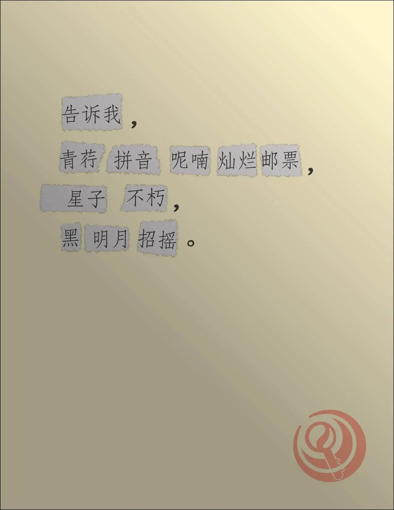

# 再另起一行的自由

## 题面

:::info
[P&KU2：再另起一行的自由](https://pnku2.pkupuzzle.art/#/game/miyue/winter_05)
:::

_诗歌也可以是拼接的艺术……_
_于其中潜藏着最终答案的艺术。_

    
点此查看所有拼贴诗

    

    

    

    

    

    

    

    

    

    

    

    

    

    

- 你可以 [访问腾讯文档](https://docs.qq.com/doc/DZUdja0xxc1FZbkF5)

## 答案

<AnswerBlock>GREAT SILENT SEA</AnswerBlock>

## 解析

题目给出了 14 首拼贴诗。在这些看似繁杂的信息中，仔细识别可以发现一些很熟悉的词语，例如“劈柴”“蔬菜”……通过搜索和确认可以意识到，这里**几乎所有的纸张碎片都来自于 14 首经典的现代诗**。

然后不难得到的一个发现是：**每一首拼贴诗的格式（也即字数及标点）都和其中一首现代诗里的某个段落相同**。并且，两者在某个相同的位置有一样的纸张碎片。例如：

> 不管人们对于我们腐烂的皮肉 那些迷途的惆怅、失败的苦痛 是**寄予**感动的热泪、深切的同情 还是给以轻蔑的微笑、辛辣的嘲讽——《相信未来》

> 彳亍 四面风 后来 榆荫 一所 坟墓 羽毛 也为你祝福、用它 细雨点 喂**寄予**早天 于玫瑰、有多少 油腻 你站在 尘世 通信 梁间、卑鄙是 冠冕

在归类之后可以进一步发现，每首拼贴诗都多出了一个不属于 14 首现代诗里的额外纸张碎片。它们分别是“有多少”“谜题的”“最终”“拼音”“答案”“原”“并以此”“字母”“标题”“请”“得到”“现代”“注意”“诗的”，重新连词成句后可以得到一句话“**请注意原现代诗的标题拼音有多少字母，并以此得到谜题的最终答案**”。（题目文案给出了“最终答案”一词，以指引出正确的排序里这两者是结合的）得到这句话的同时，我们也可以通过这些额外纸张碎片排列顺序，给原来由音序排列的 14 首拼贴诗一个新的顺序。

我们顺着这一指示继续前行。在注意到一首现代诗里剪出了很多纸张碎片分散到 14 首拼贴诗里之后，一个自然的想法就是数一数每首现代诗剪出了多少纸张碎片。然后就可以发现，**每首现代诗剪出的纸张碎片数量正好是和其标题拼音的字母数量相等的**。这也就使得每张纸张碎片都可以对应上标题拼音中的一个字母。

从而，每首拼贴诗和对应的现代诗的那张重合纸张碎片就能够被转换为一个字母！以第一首拼贴诗为例，其与《相信未来》中的一段格式相同，且其有重合的纸张碎片“寄予”。而《相信未来》一共被剪出了 14 张纸张碎片，正好和标题拼音 XIANGXINWEILAI 的字母数量相等。而“寄予”是《相信未来》原诗中剪出的第 12 张纸张碎片，所以对应字母 L。

以此对每首拼贴诗进行提取，再如前所述，按照额外纸张碎片在连词成句后的顺序进行排序。如下表所示：

| 拼贴诗               | 格式相同的原现代诗    | 重合碎片 | 重合碎片对应的字母                     | 额外碎片 | 额外碎片的顺序 |
| -------------------- | --------------------- | -------- | -------------------------------------- | -------- | -------------- |
| 第一首（彳亍……）     | 《相信未来》          | 寄予     | XIANG XIN WEI **L**AI                  | 有多少   | 8              |
| 第二首（而现在……）   | 《致橡树》            | 流岚     | ZHI XIANG **S**HU                      | 谜题的   | 12             |
| 第三首（浮躁……）     | 《一代人》            | 寻找     | YI DAI R**E**N                         | 最终     | 13             |
| 第四首（告诉我……）   | 《乡愁》              | 邮票     | X**I**ANG CHOU                         | 拼音     | 7              |
| 第五首（呵……）       | 《断章》              | 看风景   | DU**A**N ZHANG                         | 答案     | 14             |
| 第六首（会不会……）   | 《再别康桥》          | 康河     | ZAI BI**E** KANG QIAO                  | 原       | 3              |
| 第七首（金柳……）     | 《面朝大海 春暖花开》 | 劈柴     | MIA**N** CHAO DA HAI CHUN NUAN HUA KAI | 并以此   | 10             |
| 第八首（每一座山……） | 《热爱生命》          | 只顾     | R**E** AI SHENG MING                   | 字母     | 9              |
| 第九首（陌生人……）   | 《死水》              | 漪沦     | **S**I SHUI                            | 标题     | 6              |
| 第十首（你戴着……）   | 《雨巷》              | 哀曲     | YU XIAN**G**                           | 请       | 1              |
| 第十一首（取一个……） | 《你是人间的四月天》  | 放芽     | NI SHI REN JIAN DE SI YUE **T**IAN     | 得到     | 11             |
| 第十二首（我说……）   | 《有的人》            | 摔垮     | YOU DE **R**EN                         | 注意     | 2              |
| 第十三首（远方……）   | 《回答》              | 象形文字 | HUI D**A**                             | 现代     | 4              |
| 第十四首（——一潭……） | 《我爱这土地》        | 也腐烂   | WO AI ZHE **T**U DI                    | 诗的     | 5              |

于是得到答案 **GREAT SILENT SEA**。

## 作者

Winfrid（设计）；Potto（美术）

## 附言

### Winfrid

关于这道题的呈现，其实很显然是在编写 P&KU2 初期参考西方 hunt 而过度堆积 hunt techniques 而带来的败笔。虽然最后意识到问题所在，但确实有点积重难返，非常遗憾。

“拼贴诗”是一个很难不想让人去出一道谜题的题材。因为诗歌本身就包含着众多特性，而拼贴诗又是把每首诗里取一些内容拼凑在一起，简直是天然的优秀主题。

与此同时，“刻在 DNA 里的文字”、或者“集体记忆”，也是一个颇为有趣的题材，“粮食”“蔬菜”“劈柴”“喂马”夹杂在众多的词语中，也能被一眼识出并且组合起来得到《面朝大海 春暖花开》，这正是“集体记忆”的魅力所在。

最后，我最喜欢的拼贴诗句是：**“我死了，意料之中”**。和这道题的调性一致。

### Potto

不光做起来苦力，美工也很苦力。

### 生煎

苦力，起手思路不难，难的地方在于理顺数套编码规则；感觉有趣的部分很快就过去了，大部分的时间花在数数和搜索上。
