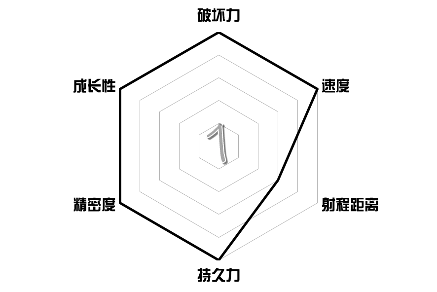
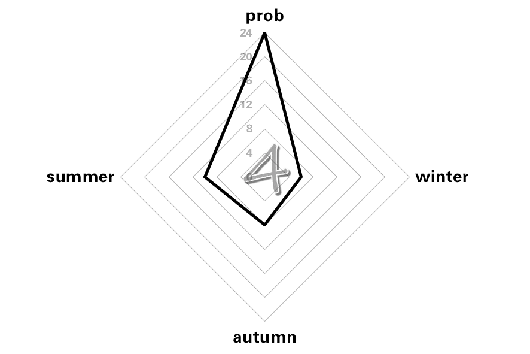
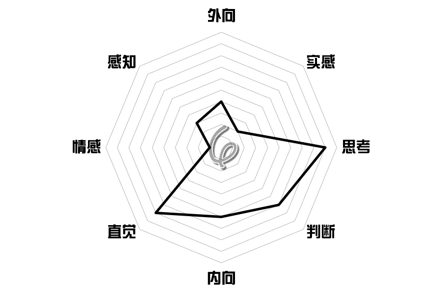
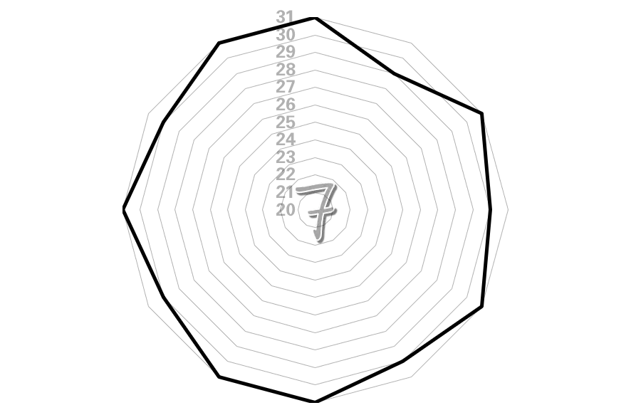
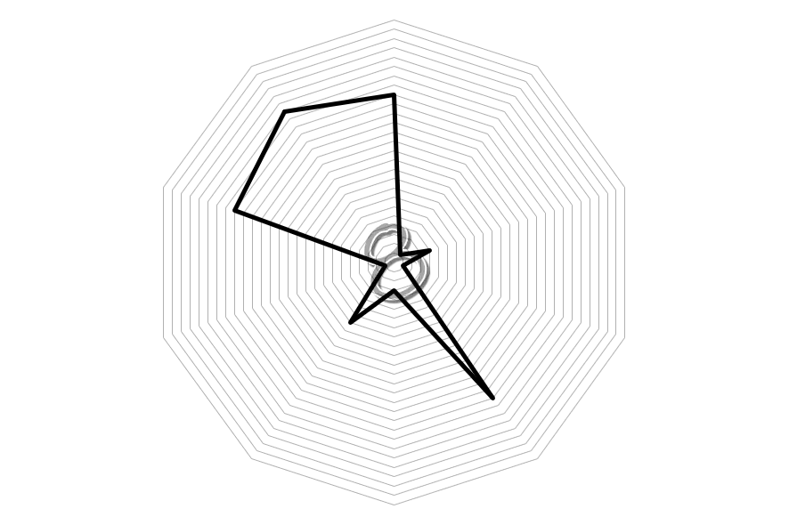
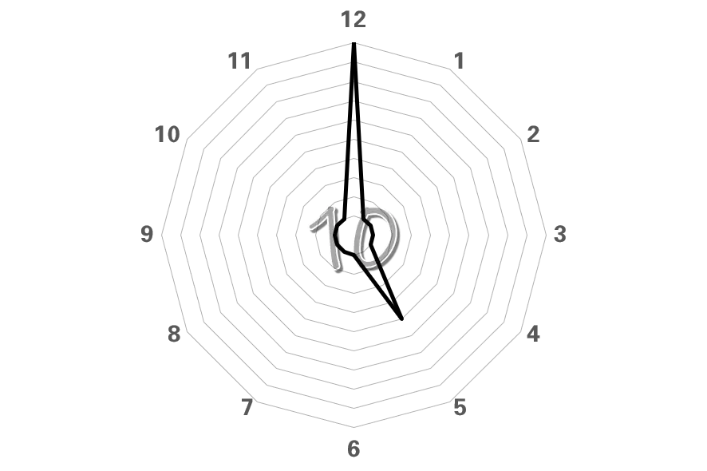
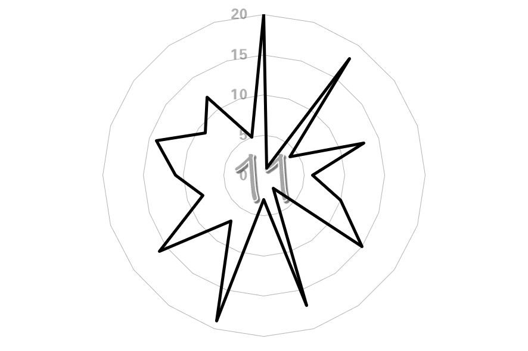
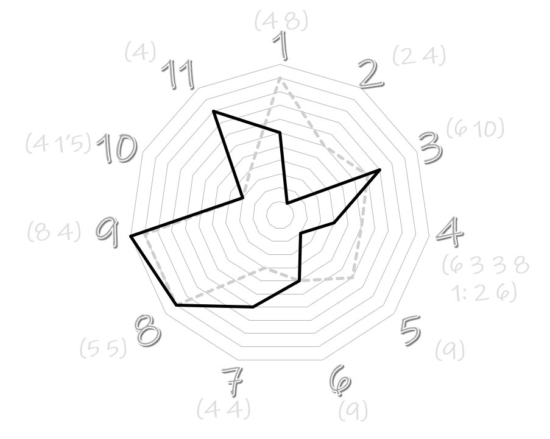

# 雷达峰的反射电波图

## 题面

:::info
[P&KU2：雷达峰的反射电波图](https://pnku2.pkupuzzle.art/#/game/miyue/autumn_08)
:::

    
题面较长，点此查看完整题面

    _如果世间万物最终归为了数据汇集的图表……_

    

    

    

    

    

    

    

    

    

    

    

    

## 答案

<AnswerBlock>GIVE INPUT TO</AnswerBlock>

## 解析

题目包含 12 张雷达图，其中前 11 张图均有一个编号，编号与第 12 张图对应。编号旁边的括号里代表了对应雷达图所表示的事物的字母数。

前十一张图分别为：

1. 替身能力六边形图 Star Platinum；
2. 六边形战士 Ma Long；
3. 北京大学学科评级 Peking University；
4. P&KU 各区域题数 puzzle and key universe 2: be spring；
5. 鸡尾酒调配方式 Margarita；
6. MBTI 量表 Architect；
7. 各月份天数，因此是闰年 leap year；
8. A1Z26 转字母 得到 radar chart；
9. 生日歌 birthday song 的简谱音高；
10. 钟表，图上是 five o' clock；
11. 飞镖盘分值，dart。

最后一张图是双雷达图，其中一条曲线是代表提取第几个字母，另一条曲线代表的是排序。从而得到答案 **GIVE INPUT TO**。

## 作者

五月（设计）；Winfrid（美工）

## 附言

### Winfrid

很有日谜风格的一套题：把同一个载体的内涵延拓到极致的产物。

好评率很高，但其实这道题是创作后期为了凑数而做出来的。只能说很多时候纵然出题人热烈的想法会让人记忆深刻，但带来的做题体验可能未必会很好。在谜题的呈现上我的确应该多向五月的这道题学习。

### 五月

↑我没觉得我是凑数出的啊。

我喜欢这种【一个概念在小题中重复并且探索各种不同的展开最后变成别的东西】的题目。

尤其喜欢六边形展示马龙和 5 o'clock 这两个小题。
