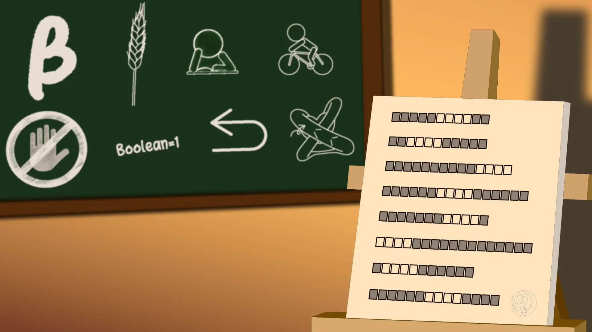

# Meta：秋

## 题面

:::info
[P&KU2：Meta：秋](https://pnku2.pkupuzzle.art/#/game/miyue/autumn_meta)
:::

_将黑板上支离破碎的记忆重新排列，_
_就能与秋天重逢。_

## 答案

<AnswerBlock>CAR TRIPS</AnswerBlock>

## 解析

本题是第二个区域的 meta 谜题。比对小题答案的长度与白板上每行的格子个数，可以发现要把下属内容填进去，并且发现每个答案都高亮了四个连续的字母：

| 答案                     |
| ------------------------ |
| BURNT **CORP**SE         |
| GI**VE IN**PUT TO        |
| BE DREAM INV**ADER**     |
| COMPUT**ER DI**SORDER    |
| BEYOND P**UERT**O        |
| **TO SP**READ YOUR WINGS |
| A**TE A B**UZZARD        |
| LIVES F**OUND** DEAD     |

根据题目文本“重新排列”的暗示，我们可以发现后面黑板上所画的内容其实是按字母表顺序排列的八个4字母单词，并且它们可以通过乱序而得到白板上的连续字母。这样，我们就可以字母表顺序的暗示、以及通过乱序处理后的字母，来反推这些图案应该代表什么单词：

BETA（β） CROP（庄稼） READ（阅读） RIDE（骑行）

STOP（停止） TRUE（正确） UNDO（撤销） VEIN（静脉）

最后，4字母乱序的题目背景加上“重新排列”的文案暗示，都指向了康托展开。简单地说，康托展开是一个全排列到一个自然数的双射，实质是计算当前排列在所有由小到大全排列中的顺序。与此同时，“将支离破碎的图像重新排列”也指出了应该把图像对应的单词字符串视作1234，以考虑黑板上的内容应该是什么排序。

| 白板上填入的答案         | 白板上的连续4字母 | 黑板上的4字母单词 | 全排列 | 对应的自然数 | 对应的字母 |
| ------------------------ | ----------------- | ----------------- | ------ | ------------ | ---------- |
| BURNT **CORP**SE         | CORP              | CROP              | 1324   | 3            | C          |
| GI**VE IN**PUT TO        | VEIN              | VEIN              | 1234   | 1            | A          |
| BE DREAM INV**ADER**     | ADER              | READ              | 3421   | 18           | R          |
| COMPUT**ER DI**SORDER    | ERDI              | RIDE              | 4132   | 20           | T          |
| BEYOND P**UERT**O        | UERT              | TRUE              | 3421   | 18           | R          |
| **TO SP**READ YOUR WINGS | TOSP              | STOP              | 2314   | 9            | I          |
| A**TE A B**UZZARD        | TEAB              | BETA              | 3241   | 16           | P          |
| LIVES F**OUND** DEAD     | OUND              | UNDO              | 4123   | 19           | S          |

按照白板上的顺序排列，得到答案 **CAR TRIPS**。

## 作者

Winfrid（设计）；Potto（美工）

## 附言

### Winfrid

康托展开序转字母加上 wordplay 的思路，其实早在设计 PV 谜的时候就有了，同时也很想将其加入 PV metas 中。然而最终却因为太难用一帧去表达而放弃了。

后来这道题成为了三个季节 meta 中的一道。一开始的时候答案设置的是 CRISP AIR，但是把一切都安排好甚至开始出小题的时候，才意识到当时的其中一个字母凑错了：安排了 SUNDOWN **OPER**A HOUSE 作为 ROPE 的2314重排列，然而实际上是2341，所以凑出来的答案其实是 CRJSP AIR。

所以，我被逼迫着只能够去从别的区域重新调来一个答案填补漏洞。但是逛遍了整个区域，再也找不到一个能够凑出来 I 的答案了，只好用 nutrimatic 搜索 ""，最后得到了现在这个 CAR TRIPS 的答案：虽然离秋季有点远，但也说的过去。因此又从相对宽松的夏季区域借来了现在这个答案。

因此不得不说，meta 一定一定要在一开始的时候就确定好！尤其是 P&KU2 这种牵一发而动全身的结构，实在是容不得闪失……都快把我给吓傻了。

### Potto

开始实际制作的第一道 meta。因为三道觅月区的 meta 是三个季节，所以打算用不同的色调在不同场景里展示。秋天当然是偏橙黄的暖色调啦，然后想到的场景是画室。

是在寒假回家的高铁上画完的。
