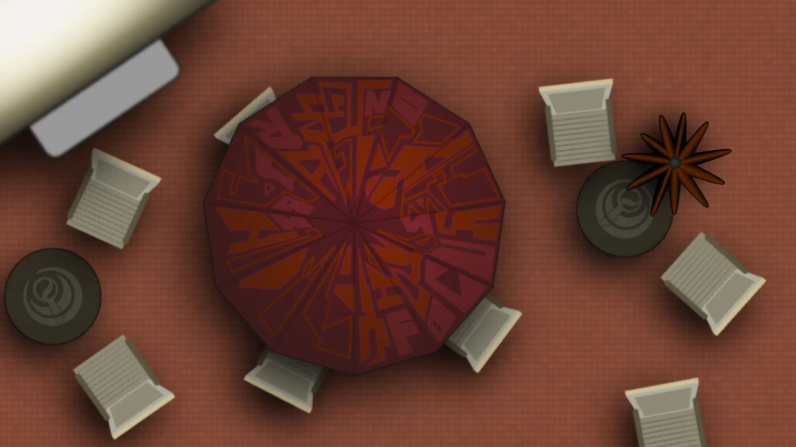
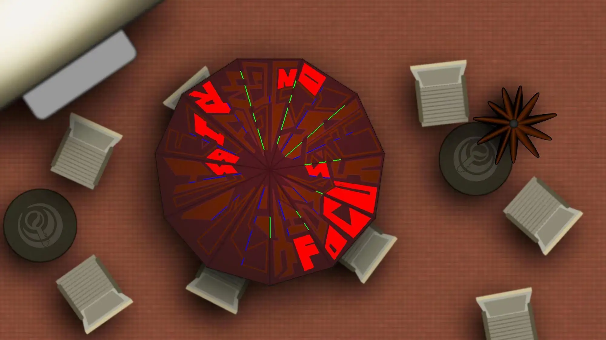

# 咖啡店外平凡的那个夏天

## 题面

:::info
[P&KU2：咖啡店外平凡的那个夏天](https://pnku2.pkupuzzle.art/#/game/miyue/summer_02)
:::

_点点光线落在阳伞上，这样的惬意的生活。_  
_能过上这样的日子得是什么样的国王呀？_  
_——可惜一切美好都在一杯咖啡泼在伞上后终结了。_

## 答案

<AnswerBlock>EZ-LINK CARDS</AnswerBlock>

## 解析

题图给了一个伞面，伞面上的图案有若干部分是存在色差的，找到这部分阅读可以读出一句话“focus on ribs”**（红色的部分）**，也就是提醒我们要关注伞的骨架。

当只观察伞骨部分的时候，会发现伞骨以点或线的样子间断的被涂上了颜色**（绿色的部分）**，这正巧符合摩斯电码的特征。于是进行转换可以得到 close it。

从而，玩家需要思考当一把伞被收起来后，俯视伞面能够看到什么，题目画面右侧有一个被收起来的小伞，或者凭借生活常识，就能意识到此时俯视伞面是伞的各个三角形的中线**（蓝色的部分）**。因此，再次重复上一步的操作，得到答案 **EZ-LINK CARDS**。

## 作者

生煎（设计）；Potto（美工）

## 附言

### 生煎

在我有限的 hunt 历程里，似乎没看到多少推演题，更多的是设计几个静态的阶段，阶段间用解题结果连接，而不是用事物本身的性质连接。后者比如 c12 的倒水、绳串我都很喜欢，也觉得有很大的出题空间——生活中观察发现，演绎推理确实蛮受大家忽视的（即使在完赛之后也看到，做题时候忽视的，在评价的时候可能仍然会忽视）。

找素材的时候关注了很多动态过程，最后想到了开关伞——“伞撑开时伞骨的地位更特殊”和“伞收起时伞面的地位更特殊”的小诡计很日常但隐秘，也确实奏效了。

觉得出得不好的地方：

1. 当在 hunt 里看到一把伞，可能通常不容易认为这是一把真的伞。这题的语境就和其他题格格不入，如何融入可能需要更好的铺垫。
2. 摩斯的方向没有和 Focus on ribs 保持一致。
3. Focus on ribs 只用在第二层还是也用在第三层，有点指示不清。
4. 摩斯起始位不明确。

### Potto

这是第二版的伞。刚开始做了个油纸伞的版本，但是效果并不是很好，于是才重新画了这个版本。
