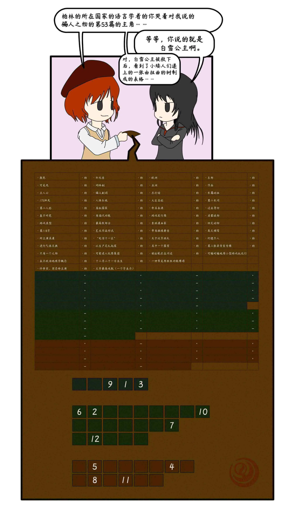
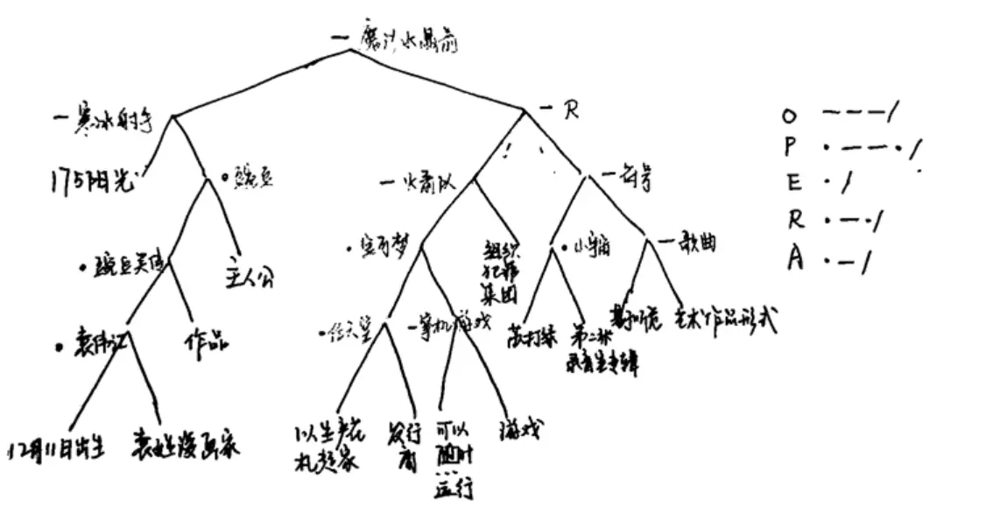

# 的的赋

## 题面

:::info
[P&KU2：的的赋](https://pnku2.pkupuzzle.art/#/game/miyue/summer_04)
:::

_这张神秘的表格到底是什么呢？_

- 你可以 [访问腾讯文档](https://docs.qq.com/sheet/DZVdkRm5nV0JRdnN0?tab=BB08J2)

## 答案

<AnswerBlock>SUNDOWN OPERA HOUSE</AnswerBlock>

## 解析

首先，映入眼帘是一个 drop quote，也就是需要在每个格子里选取该列最上方的词库中的一个不重复地放进去，以得到一句完整的话语。

题目文案给出了一个完整的例子：

> - 柏林的所在国家 = 德国
> - 德国的语言学者 = 格林兄弟
> - 你哭着对我说的骗人之物 = 童话
> - 格林兄弟的童话 = 《格林童话》
> - 《格林童话》的第53篇 = 《白雪公主》
> - 《白雪公主》的主角 = 白雪公主

- 我们可以从中发现，在最终的极长的短语里，存在着大量的偏正结构，结构十分复杂。存在“(A 的 B) 的 (C 的 D)”这种嵌套式的偏正结构，也可能是“((A 的 B) 的 C) 的 D”。
- 但上面的例子中，不会存在“A 的 B 的 C”，也就是说只会有一个“的”连接一对词的情形，不会有两个“的”连接同一层级的三个词的情形。
- 此外，另一个发现是，在不断的嵌套过程里，(A 的 B) 的 C 里的“A 的 B”取的或许并非其本意，而是“A 的 B”所描述的事物的另一个意思。例如，这里“你哭着对我说的骗人之物 ”是歌词里的“童话”，但在更高的层级，它就代表着作为文学体裁的童话。

尽管规则较为复杂，但有些搭配依然是能一眼看出的：例如“关于汉字姓氏的启蒙读物”（也就是《百家姓》），“苏打绿的第二章录音室专辑”（《小宇宙》）。从这些处于末梢的内容继续迭代和推理，最后能得到完整的形态：

| 答案：             |     |                              |     |                        |     | April    |     |
| ------------------ | --- | ---------------------------- | --- | ---------------------- | --- | -------- | --- |
| 第二人称           | 点  | 有指代功能                   | 点  | 关于汉字姓氏           | 线  | 启蒙读物 | 点  |
| 第118个字          | 线  | 文学最高成就（用一个字表示） | 点  | 亚洲                   | 线  | 东部     | 线  |
| 表示政治地理学概念 | 点  | 偏义复词                     | 点  | 带有推理要素           | 线  | 长篇动画 | 点  |
| 只有一个之物       | 点  | “电信十一区”                 | 线  | 大区名称               | 线  | 约德尔人 | 线  |
| 佟梦实、宋芸桦主演 | 点  | 网络剧                       | 点  | 一种常见男性性功能障碍 | 线  | 英文缩写 |     |

> - 关于汉字姓氏的启蒙读物 = 《百家姓》
> - 《百家姓》的第 118 个字 = 宋
> - 宋的文学最高成就（用一个字表示） = 词
> - 有指代功能的词 = 代词
> - 第二人称的代词 = 你
> - 亚洲的东部 = 东亚
> - 表示政治地理学概念的偏义复词 = 国家
> - 东亚的国家 = 日本
> - 带有推理要素的长篇动画 = 推理类长篇动画
> - 日本的推理类长篇动画 = 《名侦探柯南》
> - 《名侦探柯南》的只有一个之物 = 真相
> - “电信十一区” 的大区名称 = 暗影岛
> - 暗影岛的约德尔人= 薇古丝
> - 佟梦实、宋芸桦主演的网络剧 = 《别那么骄傲》
> - 一种常见男性性功能障碍的英文缩写 = ED
> - 《别那么骄傲》的 ED = 灵魂伴侣
> - 薇古丝的灵魂伴侣 = 影子
> - 真相的影子 = 谎言
> - 你的谎言 = 四月

值得注意的是，很多名词并非唯一，比如东亚的国家也可以是中国。但通过上下的 crosscheck 可以得到正确的解读方式。

| 答案：   |     |                  |     |            |     | ENCHANTED CRYSTAL ARROW        |     |
| -------- | --- | ---------------- | --- | ---------- | --- | ------------------------------ | --- |
| 175阳光  | 线  | 12月21日出生     | 点  | 袁姓漫画家 | 点  | 作品                           | 点  |
| 主人公   | 线  | 以生产花札起家   | 点  | 发行商     | 点  | 可以随时随地运用小型游戏机运行 | 线  |
| 游戏     | 线  | 可爱迷人犯罪集团 | 线  | 苏打绿     | 点  | 第二张录音室专辑               | 线  |
| 基于听觉 | 线  | 艺术作品形式     |     |            |     |                                |     |

> - 12 月 21 日出生的袁姓漫画家 = 袁伟江
> - 袁伟江的作品 = 《豌豆笑传》
> - 《豌豆笑传》的主人公 = 豌豆
> - 175 阳光的豌豆 = 寒冰射手
> - 以生产花札起家的游戏发行商 = 任天堂
> - 可以随时随地运用小型游戏机运行的游戏类型 = 掌机游戏
> - 任天堂的掌机游戏 = 宝可梦
> - 宝可梦的可爱迷人犯罪集团 = 火箭队
> - 苏打绿的第二章录音室专辑 = 《小宇宙》
> - 基于听觉的艺术作品形式 = 歌曲
> - 《小宇宙》的歌曲 = 符号
> - 火箭队的符号 = R
> - 寒冰射手的 R = 魔法水晶箭

| 答案：       |     |            |     |                |     | EVERFREE FOREST |     |
| ------------ | --- | ---------- | --- | -------------- | --- | --------------- | --- |
| 可见光       | 点  | 最高频部分 | 线  | 被松鼠拦在河边 | 点  | 四足动物        | 点  |
| 所主演美漫   | 点  | 虚拟国家   | 点  | 欧洲           | 点  | 第二长河        | 点  |
| 颜色         | 线  | 钚元素     | 点  | 命名来源       | 点  | 过去身份        | 点  |
| 进行气体交换 | 线  | 人体系统   | 线  | 其中一个器官   |     |                 |     |

> - 可见光的最高频部分 = 紫色
> - 被松鼠拦在河边的四足动物 = 小马
> - 紫色的小马 = 暮光闪闪
> - 暮光闪闪的所主演美漫 = 彩虹小马
> - 彩虹小马的虚拟国家 = 小马利亚
> - 欧洲的第二长河 = 多瑙河
> - 多瑙河的颜色 = 蓝色
> - 钚元素的命名来源 = 冥王星
> - 冥王星的过去身份 = 行星
> - 蓝色的行星 = 地球
> - 进行气体交换的人体系统 = 呼吸系统
> - 呼吸系统的其中一个器官 = 肺
> - 地球的肺 = 森林
> - 小马利亚的森林 = 永恒自由森林

接着，把三个答案分别放入格子，按照给定的数字顺序提取，得到 **IN LEVEL ORDER**。

查询这个词可以发现，它是树的层序遍历中的顺序，联想到文案中的“扭曲的树”，不难想到这道题和树有关。再联想到偏正结构，两者结合可以想到，其实这三个极长的词组，每个都可以转换成一棵二叉树。以第二个为例：

直到这时，给出的点和线还没有使用，因此我们按照层序遍历的顺序，把每个末端节点视作分割线，把除此之外的节点按照对应的“的”被标注了什么符号而转化为点和线，从而得到了一串 morse code。每串 morse code 被解读后都是一个单词，分别是：SUNDOWN、 OPERA、 HOUSE。所以答案显然就是 **SUNDOWN OPERA HOUSE**。

## 作者

Winfrid（设计）；Potto（美工）

## 附言

### Winfrid

这题好像是一个评价非常不统一的题呢：有很多人认为这道题的前半部分很好，最后一部分是狗尾续貂（比如一些完赛的选手）；还有不少人认为这道题前半部分很无聊，最后一部分才加以升华（staff 里的我和木华和五月）；也有像生煎这样温柔的人认为两个都很好。幸好好像其实几乎没有人认为这道题是一无是处的（吧），相当开心。

当然，其实这道题在设计上，点线的信息提早的放出确实有了很大副作用。在设计的时候，我在做题路径预设时就察觉到了这一缺陷，但我还是低估了这一信息倒挂带来的影响。或许还是拆成两题更好一些？

本题的最初灵感发端自 9 月 17 日。在那时，这道题的雏形就已经基本勾勒完成了。而在 1 月 15 日，才想到可以用层序遍历的方式来把“树”的概念利用好，搭配上 morse code 这种经典的古典密码，就有了这道题的最初版本。

在漫长的凑词之后，我开始怀疑这道题如果单纯是给三个长词组，是不是会有些太过单薄了——于是就在上面有以 drop quote 的形式把这道题扩充成了第一步也需要一定尝试和乐趣的题目。

> 五月：你在上面又盖了个大监狱 Winfrid：在大监狱里摸索应该也挺好玩的

值得一提的是，英文中的 drop quote 可以通过 nutrimatic 等工具来完成填写，但在现在的新语境下，必须要用中文语境下的直觉来完成大多数的推理过程。在此基础上，drop quote 里原先压根没有用到的列数分析以及语法分析，在这道题的语境下都能派上用场。——之前也见过一些中英文 dropquote，但都是 nutrimatic 和搜索引擎的玩物罢了，感觉这道题的 dropquote 相比之下，用到了中文里常见、本质、但是常常被忽略的一个特征，算是一个不错的创新。

现在这道题的美工已经非常精致了，芈雨和觅月的格漫形态都很可爱，但这还不是 Potto 最后想要呈现的版本——在意外之中，这道题的 Ai 文件炸了，只剩下了这么一个版本。

### Potto

很可惜的是工程文件没了啊！！！呜呜呜

就是是这么回事，我在打开没保存的工程文件的状态下，又重新点开了原本的工程文件，导致旧版本不可逆地覆盖掉了正在编辑的版本。

叹气。

但是这道题目真的很有意思，是一种结合中文特点的很新的 dropquote。在我心里排名这题是不会输给大魔法书的，可惜这题位置似乎是有些太靠后了。

### 生煎

一阶段有种 iol+纸笔的感觉，二阶段是一气呵成的高概念转化，集齐了我喜欢的要素！不过点线影响到了一阶段，降低了一点做题体验。另外觉得好的是这题对汉语的利用比起字形读音等特性是更不容易被探索到的。
