# 这迷宫让人烦得只想躺平

## 题面

:::info
[P&KU2：这迷宫让人烦得只想躺平](https://pnku2.pkupuzzle.art/#/game/miyue/summer_05)
:::

_当你在迷宫的墙上写写画画，对着墙角拳打脚踢，大声咒骂迷宫找不到出路时，_  
_你想过迷宫会对你说什么吗？_  
_你没有想过，你只关心你自己。_

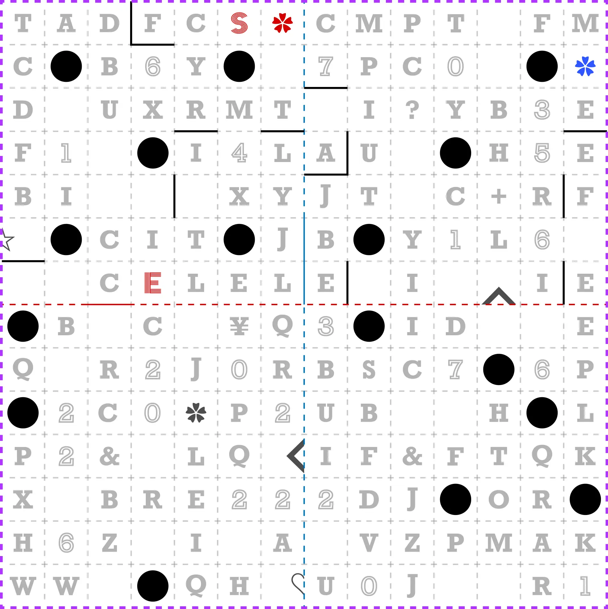

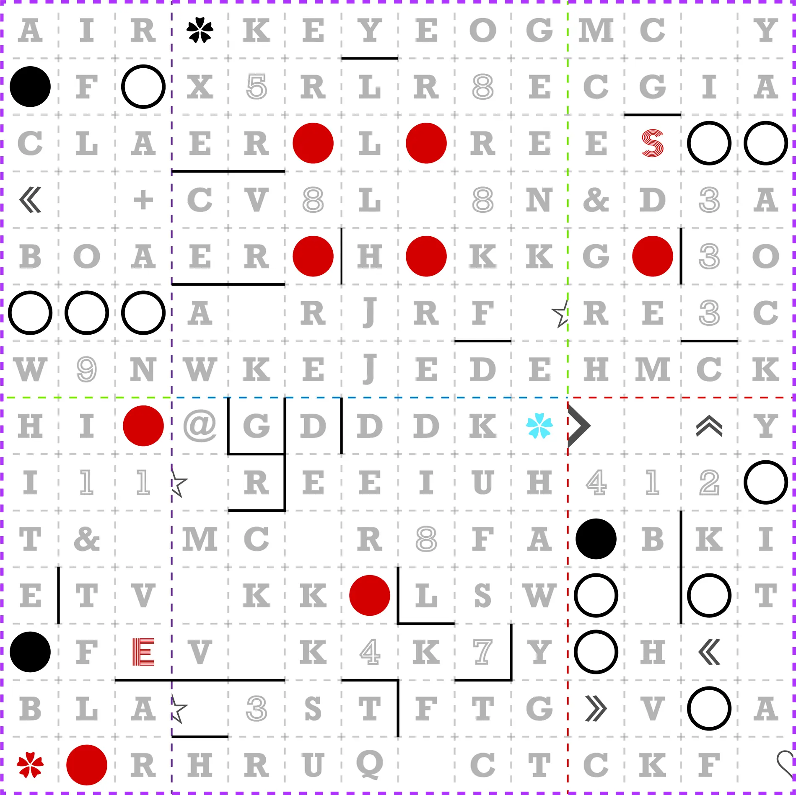

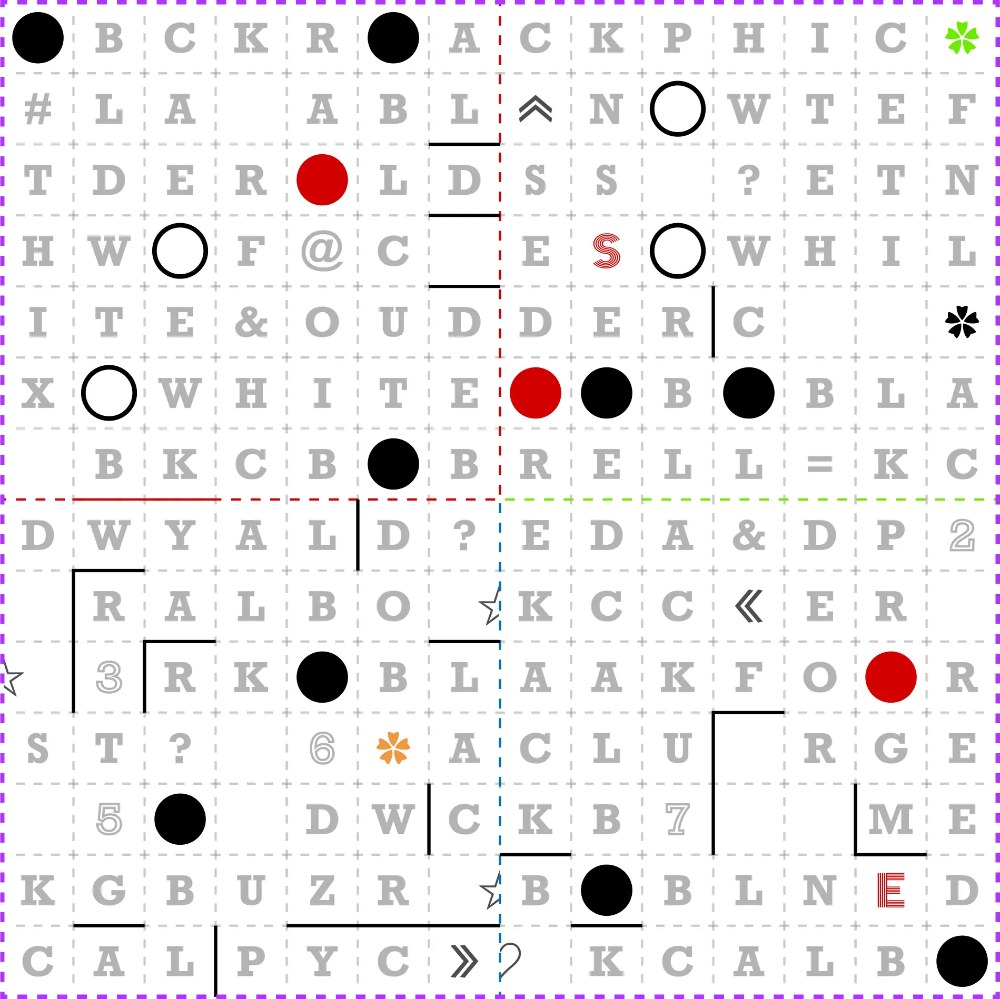

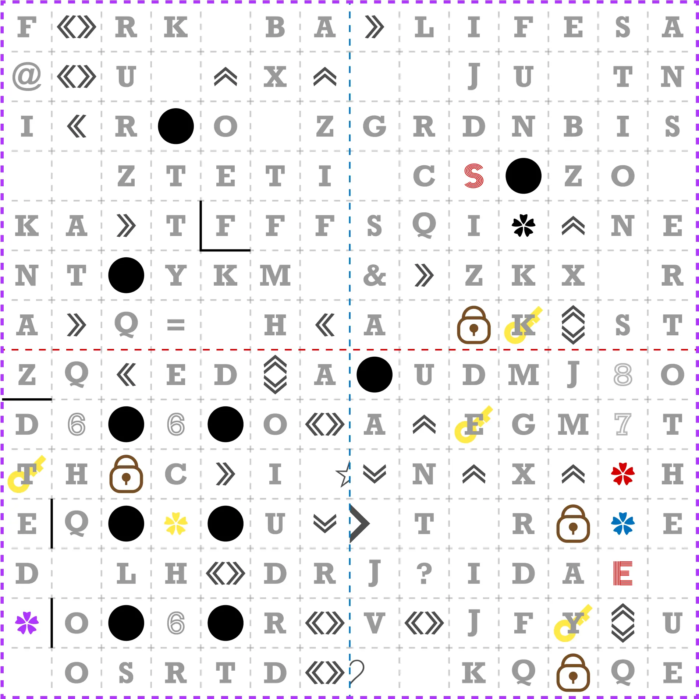

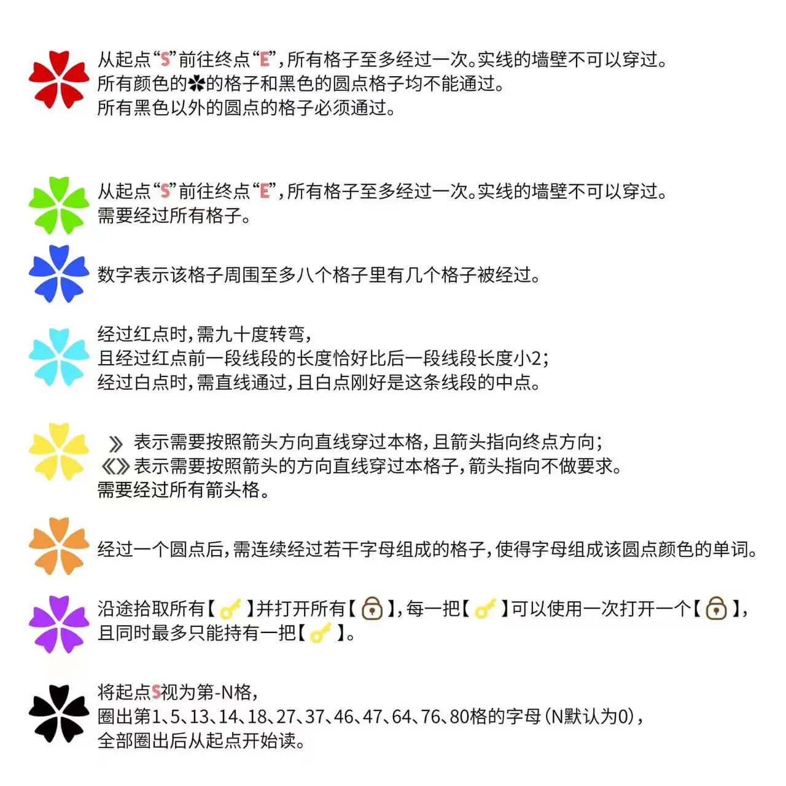

## 答案

<AnswerBlock>CUTTING TOOL</AnswerBlock>

## 解析

每条规则都包含一种不同颜色的花，这些花出现在了迷宫里，它们是具有对应关系的。换言之，盘面有什么花就意味着适用什么规则。所以，我们可以得到如下四个盘面的答案：

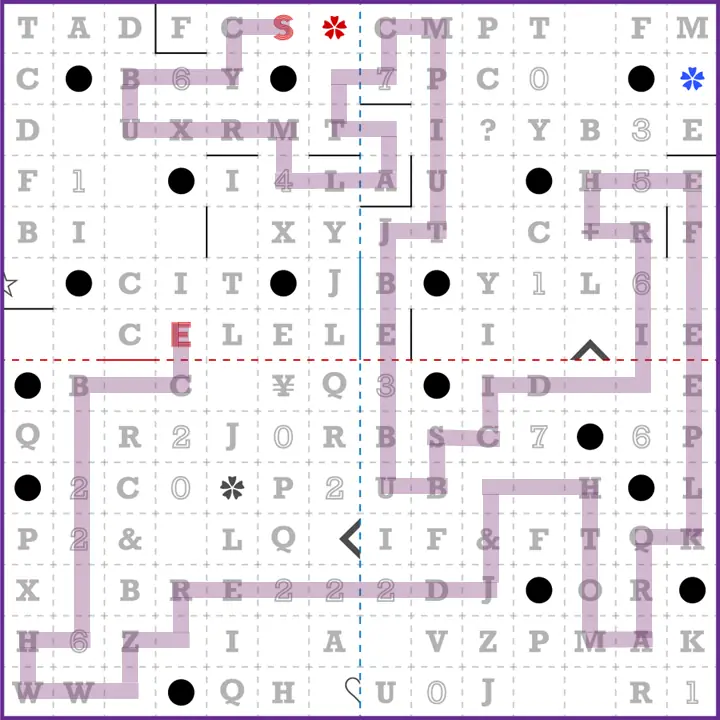

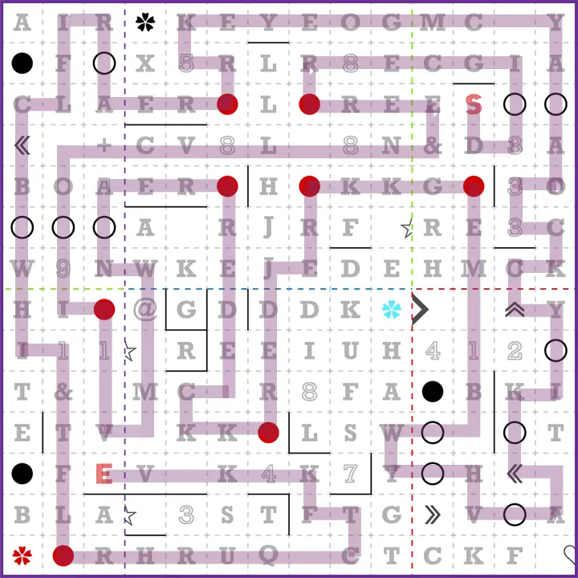

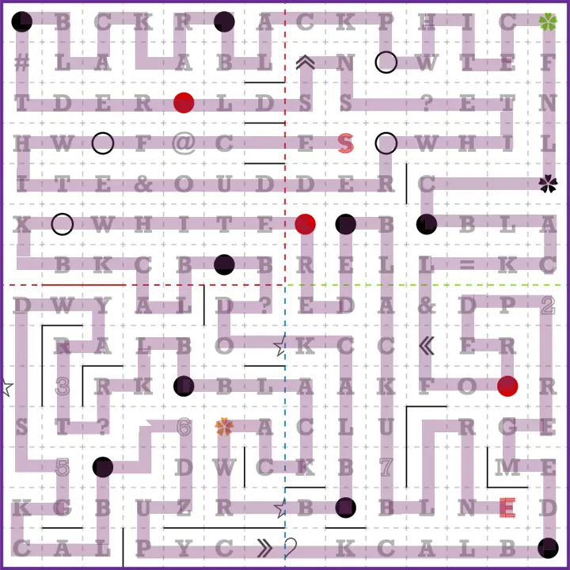

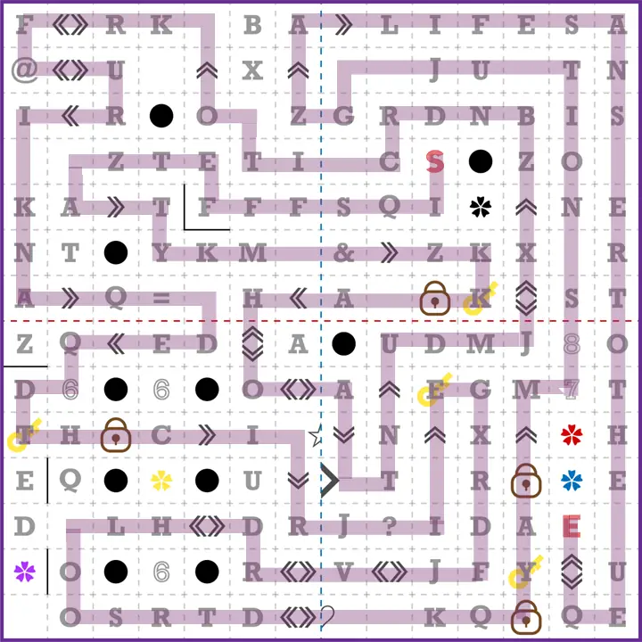

最后根据黑花的规则，读取每个盘面上的规定位置的字母，得到 **CUT PURPLE EDGE & LINE MAKE FOUR STAR N = FIFTY & HUNDRED**，所以，需要把紫色的边缘和紫色的线剪开，然后拼合在一起使得形成四个完整的星星。在此基础上做一次合成的谜题。

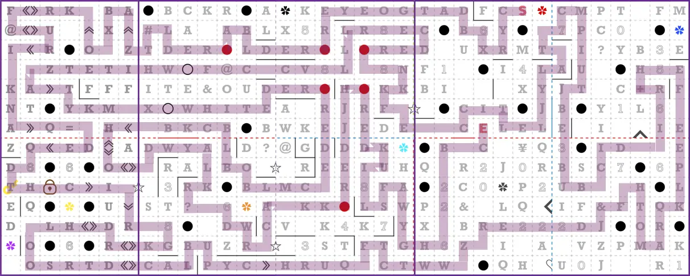

在此基础上，分别让 n 为 50、n 为 100，标出所有要读的点位之后再从起点开始读起，得到 **N = THIRTY CUT RED MAKE DICE**。从而，我们要在前一张图的基础上，剪掉红色的线，把剩下部分制作成一个骰子。

剪掉红色线条后，剩下的迷宫刚好组成了一个骰子的展开图，迷宫中的红点和黑点构成了骰子的点数。按照要求还原骰子为立方体，并重解迷宫，得到最后的答案：

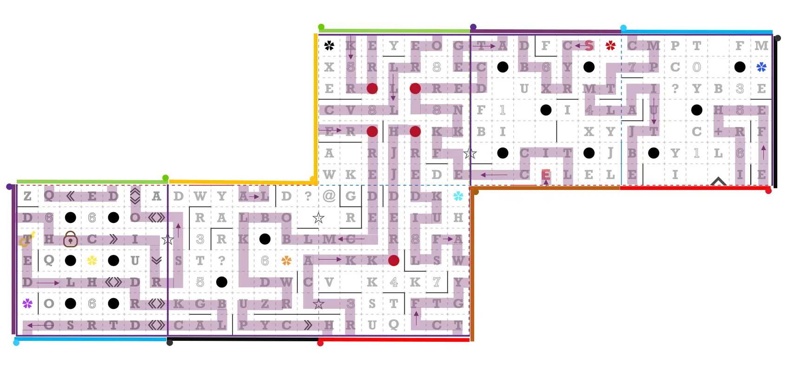

在这一基础上，按照 N=30，提取得到最终的答案 **CUTTING TOOL**。

## 作者

五月（设计）；Potto（美工）

## 附言

### 五月

对五月来说，这是整套题目中最早开始出的一题，甚至早在 PKU1 之前，当然也早在打算参与 PKU2 出题工作之前。熟悉我的玩家可能知道，我是非常喜欢出迷宫题的。在参与了 SCRAP 的 100 万谜 2022 之后，我就在想，什么时候我也能出一个究极的迷宫题啊——于是就动手出了。

但是出完之后没地方可用。对于肥咪矩阵的玩家来说，这题实在是过于长线了，如果坚持不到最后的迷宫，前面的辛苦就非常枯燥且没有乐趣。好在 HUNT 对题目形式的包容度很高，可以允许我把一个复杂度高、所需时间长、（可能）需要打印的题目放进 PKU2 中。

但随之而来的问题是如何呈现答案。我们其实是有三个层级的方案的：

- PlanA：将每一个步骤的指示都放在迷宫中，玩家做完迷宫就能读到相应的任务要求。
- PlanB：每一个迷宫都会得到一个与 PKU2 系列无关的验证用答案，验证用答案要去公众号上做验证就能得到下一步的指令。
- PlanZ：迷宫的指令以加密形式给出，玩家做完迷宫的答案是解开密码的维吉尼亚密码密钥。

最终各位也看到了，基本实现了 PlanA，但确实凑得很辛苦，也在提取部分给大家添了不少麻烦，给自己打一个 A- 吧。 如此，点-线-面三个层级的迷宫就正式出完了。我自认还有诸多不足，不过这已经是五月我这个水平下能完成的最究极的迷宫了，希望大家喜欢。

另外还要由衷的感谢生煎老师和荠菜老师的测试，顶着很多大大小小的问题做完了内测，并跟我一起修掉了发现的 bug。

### Potto

美工任务并不多，就是辛苦五月老师不停校对。

### 生煎

纸笔个人历史最佳，层层递进最后直接升维，有种格局打开的感觉。
