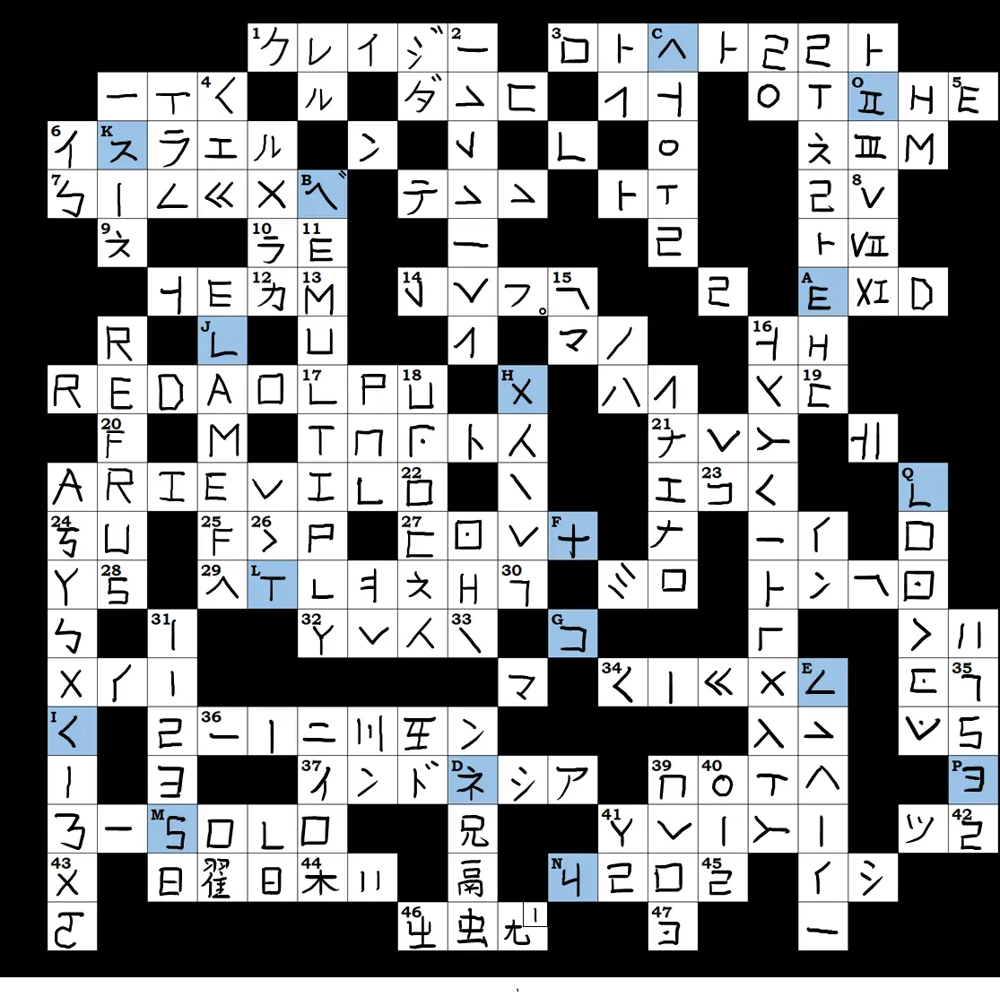
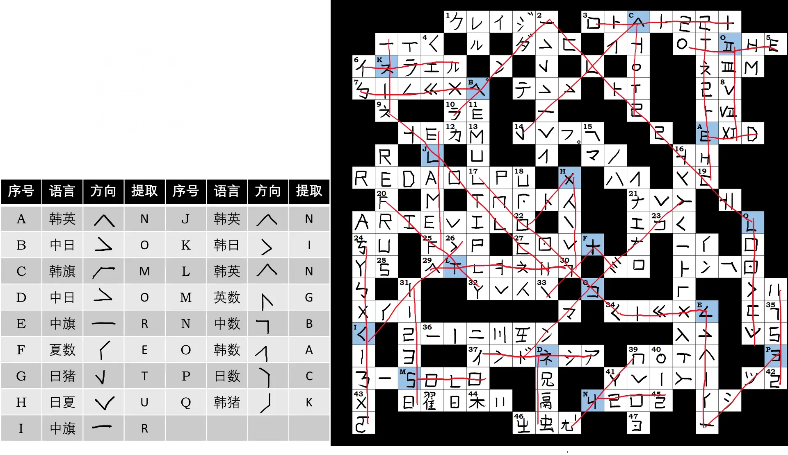

# 爱慕猫体邻国斯必克二

## 题面

:::info
[P&KU2：爱慕猫体邻国斯必克二](https://pnku2.pkupuzzle.art/#/game/miyue/summer_10)
:::

_当邻国语言的丛林簌簌作响，_  
_当引路的旗帜随风飘荡，_  
_我们又该何去何从？_

> 注：该题在编号时因疏忽缺失了“38”，但这与整体的解题流程无关

- 你可以 [下载题目内容](https://pnku2.pkupuzzle.art/media/miyue/226_summer_10_AMMTLGSBKE/AMMTLGSBKE_File_v2.pdf)

## 答案

<AnswerBlock>NO MORE TURNING BACK</AnswerBlock>

## 解析

玩家可以看到一个填字游戏。但后八页每一页的标题处都用某种语言的文字写出了一行内容，仔细辨认可以发现，每一页的标题都是用某种语言书写的线索的方向（比如左上、右上……）。

在此基础上，我们可以猜到，填字游戏共使用了八种文字/加密方式，而每条线索的条目具体使用哪一种文字或加密方式需要我们自行判断。并且，交叉路口的字形可能同时在两种不同的文字/加密方式里承担不同的含义。具体如下：

各线索的答案如[此 pdf 所示](https://3173723340-files.gitbook.io/~/files/v0/b/gitbook-x-prod.appspot.com/o/spaces%2FUjtr9No2Helz7la4Y5le%2Fuploads%2FbgGbeeSrPIbFIL697Jlb%2F%E7%88%B1%E6%85%95%E7%8C%AB%E4%BD%93%E9%82%BB%E5%9B%BD%E6%96%AF%E5%BF%85%E5%85%8B%E5%84%BF%20solution.pdf?alt=media&token=ffab7e14-3cea-48a3-b031-8fc7feb1ca6d)。

根据题目文案可知，我们需要找到语言真正的方向，也就是标题的文字揭示的内容。

因此在填完所有格子之后，需要判断出每个蓝色方格（交叉路口）所交叉的两种语言，再将其转换成对应的方向，最后通过旗语提取（根据文案里的“引路的旗帜”看出），顺序为蓝色格子的标号 A-Q 字母序。

答案为 NO MORE TURNING BACK（不再回头）。

## 作者

River（设计与美工）

## 附言

### River

River：完整版作者的话以及这题的历史版本（跟现在的版本题面和 clue 完全不一样）请看[这里](https://www.bilibili.com/read/cv23643242)

这道题的灵感首先来源于 CCBC12 的 #1909 楔形文字，当时看到这个题目的时候，我就直接读出来了：韩语的미，然后下面这五行文字，你说是夏多也行，猪圈也行，韩语也行，旗语也行，所以当时就觉得这个还挺神奇的就 mark 起来了。

后来到了十一月十二月，参加了 pb9(Puzzle Boat 9)，被里面的 crossword 疯狂折磨。同样是 crossword，它能玩出花来，平均每三四道题就能看到一个 crossword，而且提取思路还都不一样，于是决定出一道思路跟别人都不一样的 crossword。但是，用什么来 cross 呢？

某天晚上九点钟下班，走出办公室楼，应该是有二次元群友在群里用片假名发消息。我看到了フ这个片假名不是跟旗语很像嘛？然后去把片假名查了一遍，发现里面有很多跟中文很类似的部分，比如把中文的“左右”同时去掉偏旁就是“エロ”（？）等等。

然后当时又想起了 CCBC12 的 #1726 旧报纸 是一道非常有意思的双语 crossword，就在想能不能出一道 multilingual 的 crossword。于是那个晚上我便在回家的地铁上构建了这道题的思路雏形——crossword 跟方向有关，方向又跟旗语有关，crossword 又正好能表征八个方向，一拍即合！

这题可能前前后后出了上百小时吧。也迭代了好几个版本。但是最终的初心还是不变的，一方面要让大家感觉到猫体邻国的魅力，另一方面要让大家尽量快乐地苦力（毕竟我自己很讨厌苦力），所以想把这题出成一道团建题，大家可以在一人一嘴中解 clue 的时候感受到一点 crossword 的魅力。另一方面要让这题成为一道“看到就不可能没有思路”的题，所以FT也写得特别直白。

赛后受到了很多赞赏，同样地也有一些吐槽，这里可以回答一部分。其实有一部分答案是没什么办法的（希望以后可以用 AI 出这种题，人力想实在是太痛苦了），比如修女的书籍（直译）就是我在一大堆词里面找到一个勉勉强强能做的（其实当时在想要不直接去掉这个 cross 算了，后来想想能 cross 还是 cross 上好了万一有人填出来了呢），但是这个 clue 对韩语水平要求还挺高的，至少你得意识到韩语里面一个字对应中文里面一个字，它的原文是“修女书”三个字。再比如说那个不好查到的英国皇家学会会员，也是 nu 出来的没什么办法。

总而言之非常感谢 Winfrid 和内测组各位选中并修缮了这道题！也更要感谢所有享受做这道题的过程的玩家！看到有些队伍的 writeup 以及某些佬的评价我真的感动地流下了泪水 qwq 这道题对我的影响是既有鼓励也有压力在的（害怕之后出的题没有这个好了），不过我会尽力把这种能让我感到愉悦的事情坚持下去的！

### Winfrid

一个很多出题者都曾经幻想过但是没有出出来的东西，也正因如此，原先不打算有 crossword 的 P&KU2 也把标准改为了“除了这道题之外不要有别的 crossword”。

River 的点子和执行力真的是太强大了。

### 生煎

之前没见过River的题，绝对是惊艳出场！
