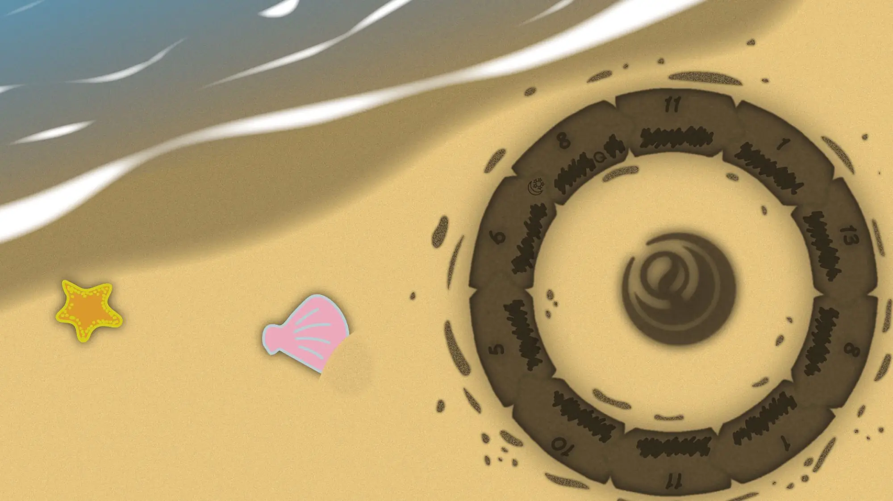

# Meta：夏

## 题面

:::info
[P&KU2：Meta：夏](https://pnku2.pkupuzzle.art/#/game/miyue/summer_10)
:::

_将言语里答非所问的片段归而复始，_
_就能与夏天重逢。_

## 答案

ICED DRINKS

## 解析

本题是第三个区域的 meta 谜题。题目会有一个**等分成十部分**的环，每个部分会写上一个数字。同时，在环的特定位置标注了一个字母Q。

注意文本里的“答非所问”：在一般的 puzzle 里，答案和谜题的主题/问句往往是有所关联的。但是在这个区域，如果仔细观察，就能发现每道题在文本里都有一个问句，然而每个题目的问句和自己的答案一点都接不上，而是和另一道题的答案接上了！这其实就能够让我们形成一个闭环（loop），也照应了题目中的圆环：

| 谜题的问句                                                                             | 谜题的答案           | 与答案能对上的问句                                                                     | 数字 | 提取出的字母 |
| -------------------------------------------------------------------------------------- | -------------------- | -------------------------------------------------------------------------------------- | ---- | ------------ |
| 在邻国语言的丛林里，在引路的旗帜遁入黑夜时，在呼啸的风中，我们该何去何从？             | NO MORE TURNING BACK | 你想过迷宫会对你说什么吗？                                                             | 11   | I            |
| 你想过迷宫会对你说什么吗？                                                             | CUTTING TOOL         | “这么烂的作文只配送去碎纸机你知道吗？”                                                 | 1    | C            |
| “这么烂的作文只配送去碎纸机你知道吗？”                                                 | SHARING NATIVE LAND  | 彼十彼刻，恰如此十此刻，为何如此相像？                                                 | 13   | E            |
| 彼十彼刻，恰如此十此刻，为何如此相像？                                                 | HELLO VODKA          | 这写的啥呀？也不知道作者是谁，但看起来总觉得像是谁喝醉后的喃喃呓语。                   | 8    | D            |
| 这写的啥呀？也不知道作者是谁，但看起来总觉得像是谁喝醉后的喃喃呓语。                   | DWARVES' MENU        | 这张神秘的表格到底是什么呢？                                                           | 1    | D            |
| 这张神秘的表格到底是什么呢？                                                           | SUNDOWN OPERA HOUSE  | 演出进行到黄昏，台上的演员边吟唱着边向观众席分发试卷。这究竟是什么地方啊？             | 11   | R            |
| 演出进行到黄昏，台上的演员边吟唱着边向观众席分发试卷。这究竟是什么地方啊？             | HE LEFT AGAIN        | 斜的、圆的、方的 剔透玻璃。 咦？刚才不是还有人在这里吗？                               | 10   | I            |
| 斜的、圆的、方的 剔透玻璃。 咦？刚才不是还有人在这里吗？                               | STRANGE MASKED KINGS | 
点点光线落在阳伞上，这样的惬意的生活。 能过上这样的日子得是什么样的国王呀？
 | 5    | N            |
| 
点点光线落在阳伞上，这样的惬意的生活。 能过上这样的日子得是什么样的国王呀？
 | EZ-LINK CARDS        | 
哇，图案真好看，是为你量身定制的吧。 这是哪个国家的卡呀？
                   | 6    | K            |
| 
哇，图案真好看，是为你量身定制的吧。 这是哪个国家的卡呀？
                   | GO AGAINST SQUALLS   | 在邻国语言的丛林里，在引路的旗帜遁入黑夜时，在呼啸的风中，我们该何去何从？             | 8    | S            |

在此基础上，左上角给出的“Q”确认了那个部分是某个唯一含有 Q 的答案。此外，那个图标代表的是新加坡，和某个题的文案是呼应的。所以实际上就知道了整个循环的方向。——于是顺序知道了、起点也知道了，就可以把所有答案给放在正确的位置了。

接下来提取即可得到答案 **ICED DRINKS**。

## 作者

Winfrid（设计）；Potto（美工）

## 附言

### Winfrid

在 Puzzle hunt 里，有很多解题者和出题者心照不宣的经验，而“谜题的答案和谜题的背景一致”就是其中之一。如果这一规则被刻意违反，会得到怎样的题目呢？——这就是这道题诞生的背景。

其实这个点子被征用，主要还是两点：第一，对答案的要求很低（因为本质是一个题面藏在各个小题 ft 里的壳 meta）；第二，loop 让这道 meta 只有在做出大多数小题答案后才能被解出。
