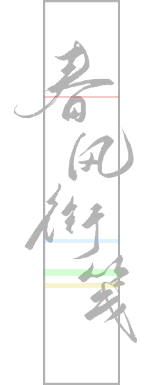
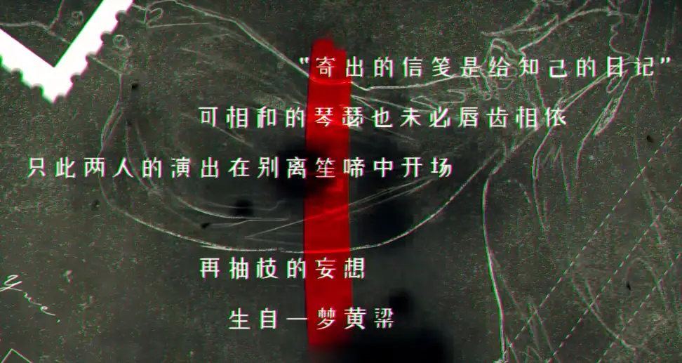
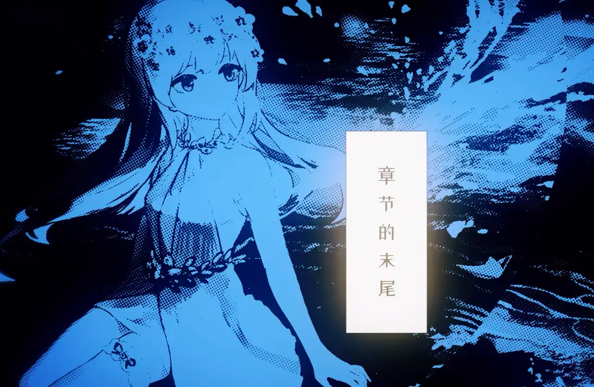
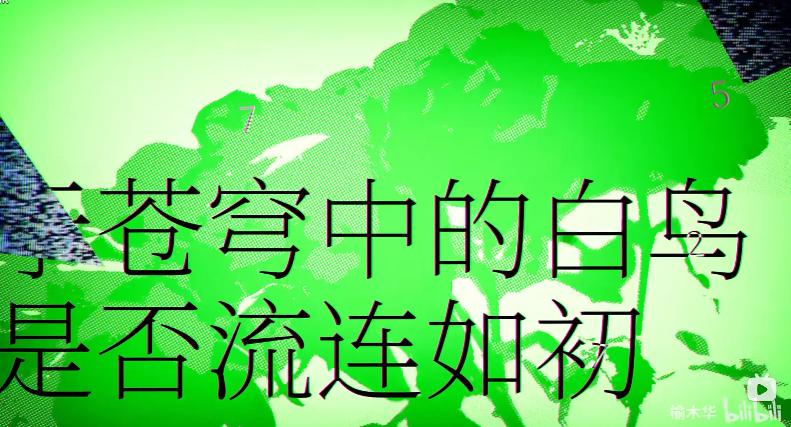
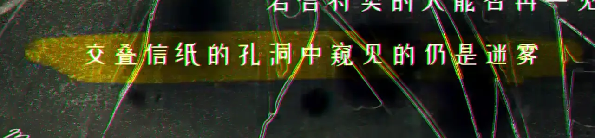

# Meta：春风衔笺

这是觅月区完成前一道题（春之密约）后解锁的 PV meta。同时，这里也包含着完成这道题的下一步的内容。它们共同构成了 P&KU2 的核心。

不妨先看看[主题曲信息](../../theme-song.mdx)。

## 题面

:::info[题目存档站链接]
[P&KU2：Meta：春风衔笺](https://pnku2.pkupuzzle.art/#/game/miyue/be_spring_meta)
:::

_说不定觅月的信笺的组合方式从来都不是预设的那样?_ 
_如此想着，破碎的记忆在春风中重新拼合，寻求着命运的安排。_

> 回环的罅隙齐整的序次再度的诠释渐短的文辞

## 答案

- <AnswerBlock>PHANTOM</AnswerBlock>
- <AnswerBlock>DELUSION</AnswerBlock>
- <AnswerBlock>MIRAGE</AnswerBlock>
- <AnswerBlock>PIPE DREAMS</AnswerBlock>

## 解析

本题是觅月区域的 PV meta。

首先，通过标题（《春风衔笺》）、文本（其歌词）、背景音乐（这首歌）都能够毫无疑问地了解到这首歌在这道题里的重要地位。浏览其 PV 可以发现，四种颜料桶的颜色其实都存在于 PV 的某个部分！

- 红色：“寄出的信笺是给知己的日记”/可相和的琴瑟也未必唇齿相依/只此两人的演出在别离笙啼中开场/再抽枝的妄想/生自一梦黄粱
- 蓝色：章节的末尾
- 绿色：于苍穹中的白鸟是否流连如初
- 黄色：交叠信纸的孔洞中窥见的仍是迷雾

再度仔细查看，就可以发现，它们似乎就是四个 meta 的谜面（而下面的四行字也分别进行了对于谜面的补充）。那么，染色这一过程，其实就是把 24 个答案分给四个 meta 的过程！

我们的 24 个答案是：

- WOMAN IN FOREST
- GREAT SILENT SEA
- FINAL OR SEMI
- CURRENT GHOST BAMBOO
- ORME SHOE
- POSTWAR OEDIPUS
- BURNT CORPSE
- BEYOND PUERTO
- COMPUTER DISORDER
- LIVES FOUND DEAD
- ATE A BUZZARD
- GIVE INPUT TO
- TO SPREAD YOUR WINGS
- BE DREAM INVADER
- NO MORE TURNING BACK
- CUTTING TOOL
- SHARING NATIVE LAND
- HELLO VODKA
- DWARVES' MENU
- SUNDOWN OPERA HOUSE
- HE LEFT AGAIN
- STRANGE MASKED KINGS
- EZ-LINK CARDS
- GO AGAINST SQUALLS

### 红色

> “寄出的信笺是给知己的日记”可相和的琴瑟也未必唇齿相依只此两人的演出在别离笙啼中开场再抽枝的妄想生自一梦黄粱

五行字从上到下出现，并且让“**寄琴笙妄梦**”处在居中的一列。然后下一帧，所有文字消失，有一个刷子/荧光笔之类的东西在从上到下划出居中的一列。那么非常明显，这五个字就是关键。

在 24 个小题中，我们可以发现若干三小词的题，并且它们的首尾的词都可以被翻译成中文：

| 答案                 | 第一个词的中文 | 最后一个词的中文 |
| -------------------- | -------------- | ---------------- |
| STRANGE MASKED KINGS | 奇             | 王王             |
| CURRENT GHOST BAMBOO | 今             | 竹               |
| LIVES FOUND DEAD     | 生             | 亡               |
| WOMAN IN FOREST      | 女             | 林               |
| SUNDOWN OPERA HOUSE  | 夕             | 宀               |

它们两两组合在一起也正是“寄琴笙妄梦”五个字，由此形成了一个回环。

首尾用到了，那么根据“回环的罅隙”，将中间的词语（“罅隙”）连在一起，就得到了 MASKED GHOST FOUND IN OPERA（在歌剧里被发现的戴面具的鬼魂），答案则是 **PHANTOM** （《歌剧魅影》里的魅影）。

### 蓝色

> 章节的末尾

除这个词之外，PV 内没有任何其它信息。

事实上，在 24 个答案里有很多有着相同长度的答案，它们分别是：

| 答案首字母 | 答案        | 答案末字母 |
| ---------- | ----------- | ---------- |
| A          | ATEABUZZARD | D          |
| B          | BURNTCORPSE | E          |
| C          | CUTTINGTOOL | L          |
| D          | DWARVESMENU | U          |
| E          | EZLINKCARDS | S          |
| F          | FINALORSEMI | I          |
| G          | GIVEINPUTTO | O          |
| H          | HELEFTAGAIN | N          |

它们的首字母正好遍历 A-H，联系上“齐整的序次”可知，排序好之后按照歌词的指示提取“章节的末尾”即可，得到答案 **DELUSION**，意为妄想、错觉。

### 绿色

> 于苍穹中的白鸟是否流连如初

想要知道“再度的诠释”是什么，就要知道第一次诠释是什么。

PV 中展示的是画面是《白鸟过河滩》的 pv 的若干个排列好的碎片，每个碎片上还写有数字。然而，其实这些早在开赛之前就被当作彩蛋解读过，当时认为，每个碎片和《白鸟过河滩》的一个写有歌词的碎片形状相同，所以直接用碎片上的数字去提取对应的歌词就好：

| 碎片对应的歌词              | 碎片写有的数字 | 提取的汉字 |
| --------------------------- | -------------- | ---------- |
| 你要**飞**得更高 不要回来   | 3              | 飞         |
| 白鸟我的白**鸟** 逆着风去吧 | 6              | 鸟         |
| 海**不**问我从何处来        | 2              | 不         |
| 白鸟白鸟展翅**入**苍天      | 7              | 入         |
| 那是你我共同**故**乡        | 7              | 故         |
| 就来我的**梦**里边          | 5              | 梦         |

当时的答案是“**飞鸟不入故梦**”，是对于歌词“于苍穹中的白鸟是否流连如初”的回答和呼应。

然而，如果把这道题作为 meta 来看待，那么其实，我们很容易能找到与这些歌词的含义相同的答案。那么如果用数字提取这些答案而不是歌词本身，就有了另一个答案：

| 碎片对应的歌词          | 歌词对应的答案       | 碎片写有的数字 | 提取的字母 |
| ----------------------- | -------------------- | -------------- | ---------- |
| 你要飞得更高 不要回来   | NO MORE TURNING BACK | 3              | M          |
| 白鸟我的白鸟 逆着风去吧 | GO AGAINST SQUALLS   | 6              | I          |
| 海不问我从何处来        | GREAT SILENT SEA     | 2              | R          |
| 白鸟白鸟展翅入苍天      | TO SPREAD YOUR WINGS | 7              | A          |
| 那是你我共同故乡        | SHARING NATIVE LAND  | 7              | G          |
| 就来我的梦里边          | BE DREAM INVADER     | 5              | E          |

答案为 **MIRAGE**，意为海市蜃楼。

### 黄色

> 交叠信纸的孔洞中窥见的仍是迷雾

除了这句歌词没有其它信息。

“交叠”“孔洞”能够让我们想到在 24 个答案中的一系列双单词答案，它们的两个单词长度相同，从而和“交叠”呼应。找出它们之后，更容易发现的是：它们的每个单词都有一个字母 O，这就和“孔洞”相呼应了。

所以根据歌词指示，我们要把每个答案的两个单词交叠起来，看看透过孔洞能看见什么——其实也就是看看 O 的位置上有什么。

| 答案                      | 交叠后看到的第一个字母 | 交叠后看到的第二个字母 | 单个词的长度 |
| ------------------------- | ---------------------- | ---------------------- | ------------ |
| COM**P**UTER D**I**SORDER | P                      | I                      | 8            |
| **P**OSTWAR O**E**DIPUS   | P                      | E                      | 7            |
| BEYON**D** PUE**R**TO     | D                      | R                      | 6            |
| H**E**LLO VODK**A**       | E                      | A                      | 5            |
| OR**M**E **S**HOE         | M                      | S                      | 4            |

在找到交叠后的字母之后（先找第一个字母，再找第二个字母），注意到每个词的长度正好遍历了 4、5、6、7、8，因此尝试按照长度排列……根据“简短的文词”，最终在按照从长到短的排列中得到了答案 **PIPE DREAMS**（白日梦）。

### 通向下一步的道路

每解出一个答案提交，题目下方的四个矩形之一会亮起，同时解题者可以得到正确答案的自动回复：**“答案是正确的。但得到了这个答案，又有什么意义呢？”**——的确如此，毕竟四个答案 PHANTOM、DELUSION、MIRAGE、PIPE DREAMS 全是表示“毫无意义”的词语。等到四个答案都解出后，页面上会增添一段观测者的话：

> 观测者用混沌的眼睛盯着你：
> “尽管这一切都没有任何意义，你还是坚持做出了所有答案吗？”随即，她叹了一口气，无奈地说道：
> “那我还是给你一些提示吧。”
> _**“虽然所有的答案都没有意义，但你的努力并不是白费。你为每一片破碎的记忆找到了它的归宿，为每一封信笺找到了它的同类。其实，还有一封信隐藏在这四种色彩的交汇之处。”**_
> 说起来，那封信满溢着春天的气息，同时也能够冥冥之中勾连起芈雨和觅月所写的，数量相等的信笺。

答案没有意义，那么什么有意义呢？需要做的是寻找信笺，那么需要知道这个信笺的什么东西呢？这些都要求我们关注觅月区信笺的标题。而刚才所做出的答案没有意义，有意义的其实是为了做出答案而分的组，所以下面要寻找同组里标题的共性，最后找到“四种色彩的交汇”。

具体来说，在 P&KU2 的选题页面中，配备了一个叫做“题目跳转框”的地方，它可以通向任何一个你知道了标题、且已经解锁了的题目。假如我们用它来去找到我们需要的谜题的话，那我们至少应该知道它的标题！如果真的是这样的话，那么“答案没有意义”也能解释清楚了：PV meta 的四个答案本身没有任何意义，只有“**这24个小题被分成了四部分**”这一点才是有用的！

仔细观察四个部分的小题各自的标题，可以发掘出其中的一些共同点，如下：

| 答案        | 标题特征                     |
| ----------- | ---------------------------- |
| DELUSION    | 中间的字读“fan”              |
| PIPE DREAMS | 七个字且倒数第三个字带有“化” |
| PHANTOM     | 含有雅、颂、赋、比、兴       |
| MIRAGE      | 含有数                       |

那么，这四种特征的交集可能就是我们需要寻找的标题。它是七个字，且倒数第三个字带有“化”（很多常见的字都出现过了，但”花“还未出现），含有数（考虑到两部分都是24，那么这个数很有可能是二十四），中间的字读“fan”，同时和它同为 PHANTOM 组的小题答案包括了“雅颂赋比兴”，它自己想必含有“风”（六义之一）。

另外，观测者还说了一段话，“满溢着春天的气息”、“数量相等”暗示着倒数第三个字应该是“花”，含有的数很有可能是二十四。虽然这些特征未必能锁定到唯一的解，但所幸题目跳转框是允许枚举的。通过搜索引擎的搜索以及后续的反复尝试，不难找到那个需要寻找的谜题：**《二十四番花信风》**。而找到这个谜题的这段经历本身，就是觅月设下的 finalmeta。

> 事实上，《二十四番花信风》在完成了芈雨区的 finalmeta 后就解锁了，也就是说只要完成了那个拼图，就可以在谜题跳转框输入“二十四番花信风”进入最后的 finalmeta。

## 作者

Winfrid（设计与美工）

## 附言

### Winfrid

做一个 PV 谜是我们在一切未定之时就有的想法。同时，meta sorting 作为核心思路也是我们在一切未定时就有的想法。既然 PV 如此耗精力，不如就拿来多出几个题吧！——于是就有了 PV 谜和 meta sorting 的结合。

而出题时另一个有趣的点是，meta sorting 的过程得到了什么呢？或许可能帮助后续做出 meta，但事实上，“筛选”本身就是一个需要有正反馈激励的点才对。带着这样的想法，我们把觅月区的 finalmeta 做成了一个没有题面而只有概念过程的一个“题”，附带上**“答案没有意义，过程才有意义”**的揶揄意味的箴言，让它和芈雨区的 finalmeta 的**“答案没有意义，题面才有意义”**遥相辉映，共同构成了对于谜题本质的一种追问。

此外，这里我们设计上的解题者的情绪高潮点，而后面真正的 finalmeta 反而只是平稳落地的一种手段而已。

最后，凑这几个答案真的把人给累死了，比 P&KU1 还难凑。如果还有 P&KU3，绝对不会再这么折腾自己了！

> 另外，在实际做题的时候，有些队伍是靠“毫无意义”的字义枚举出了四个答案中的一些。但是，这些却恰恰让他们无法在接下来的步骤里顺利的分组。可以说，答案是真的没有意义啊。（笑）

### 五月

我们一度卡在了 4 个 PV 题（一开始是 5 个 PV 题）如何分配标题名称。我们很确定有一个是“风”但是怎么暗示“风”成了个大问题。四组小题的数量分别是 5、5、6、8，这意味着最好用的八卦或者四元素来 call 到风都数量对不上。极其偶然的，我在搜六个一组的东西的时候，找到了风雅颂赋比兴。大家很开心。

### 生煎

觉得找到“二十四番花信风”确实达到了预想的高潮效果，也可以看到其他的所有meta的存在本身都是为了服务它（比如要藏 meta sorting 所以有了冬秋夏）。觉得这也是 pku2 艺术化的一点：表达比平衡重要。
