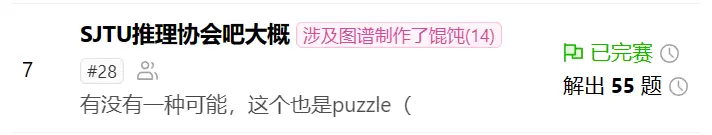
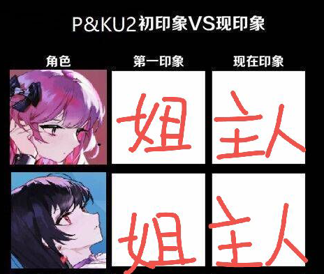
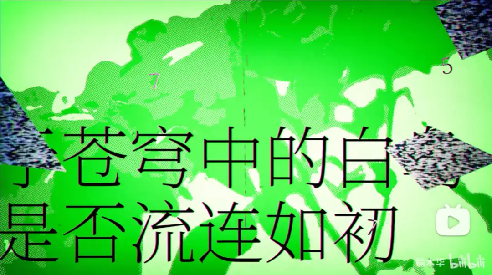
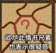
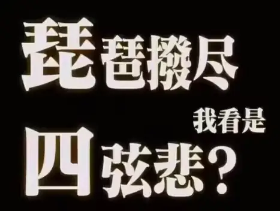
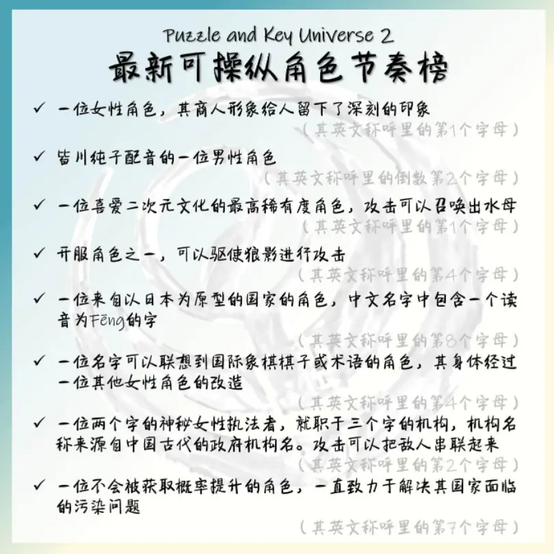
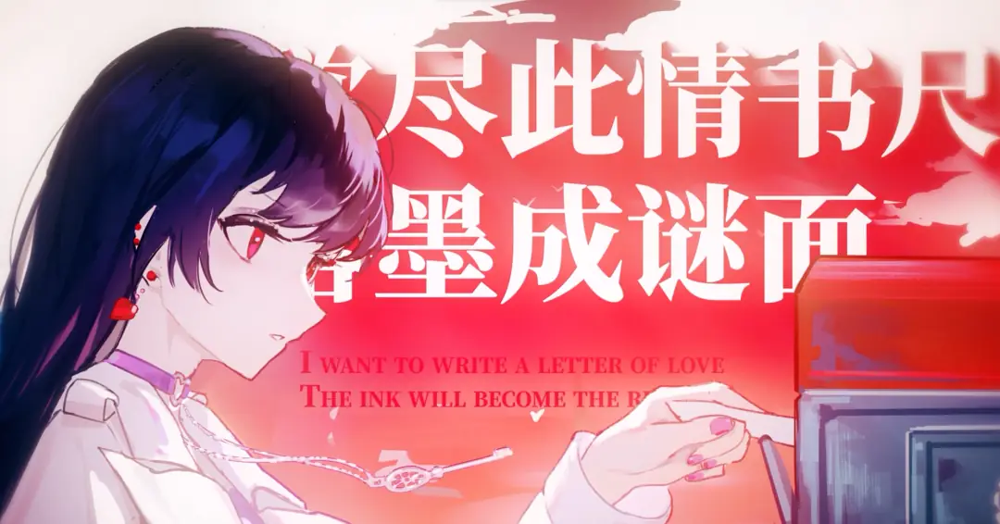

# Winfrid

:::info
这篇文章由 Winfrid 在 2023 年 5 月 13 日发布于 Rivenux 公众号。
:::

经过 9 天的比赛，有史以来人数最多的 P&KU 画上了圆满的句号。感谢新老朋友们提供的宣传支持，感谢所有 staff 的辛苦付出，更要感谢所有选手们的精彩参与。

本次活动共有 **1800+ 人、700+ 支队伍**参加，最终共有 **128 支队伍**完成了活动全程。与此同时这次活动的选手列表里不乏颇负盛名的密吧元老，还有其它国内高校的朋友们，也有着来自于国外的解谜同好。详细的完赛队伍名单请见排行榜留档。

无论是活动人数的增加，还是参赛群体的延拓，与其称作 P&KU 系列本身的成果，不如说是近一两年国内的解谜社群蓬勃发展的必然。相信在未来，能够有更多人感受到解谜的魅力，也能有更多的创作者孕育出自己的作品。

另外，欢迎大家在公开平台上（B 站、知乎）发布属于自己的完赛总结，比如[《参加解谜比赛 P&KU2 是一种怎样的体验？](https://www.zhihu.com/question/599667777)我们会对 writeup 的作者们发去观测者的周边文件夹！（但是需要自付邮费，且总量两位数，发完即止哦——不过还是够发一阵的）

下面会对于本次 P&KU2 的一些有趣的部分进行简要的回顾，其中包含足量剧透，请酌情观看\~

## 属于故事主角的舞台

P&KU 系列相对于其它众多解谜系列的最为突出的特色，就是剧情的重要地位（毕竟 Winfrid 就好这口）。
在 P&KU2 里，不仅剧情变得比前作更好懂了，而且故事情节还和整体的谜题结构高度相关，
甚至还专门为剧情制作了一支洛天依演唱的歌曲[**《春风衔笺》**](../theme-song.mdx)。从而，这次剧情的讨论热度也高了很多。

《春风衔笺》由创作过许多东方组曲与音 mad 的 **榆木华** 作编曲，由 Winfrid 作词，由中文虚拟歌姬圈内的知名肝帝 **鬼面P** 调教，由制作/参与过许多商稿的 **ACR** 与 **蒼blue** 分别负责曲绘与 PV，同时整体上也有 **血焰玖蝶** 和 **哈士奇P** 等其他 dalao 参与。我能和如此一批闪耀着才能的大家合作，实在是不胜荣幸。

整首曲子不仅视听效果华丽，同时作为 P&KU2 的宣传曲，其中也不出意外地暗藏着一个简单的彩蛋谜题：其实某几秒的画面是与《白鸟过河滩》相关！于是，大家很快地就解出了正确答案，不过，这就是这首曲子的全部秘密吗？

## 暗藏无数玄机的旅程

在这次活动里，玩家会跟随着观测者的指引，去解读主角 **芈雨**（音同谜语，puzzle）与 **觅月**（音同密钥，key）写给彼此的信笺。也因此，本次的谜题主要分为芈雨和觅月两个区域，而每道谜题都是一封信。

每解开芈雨区的一封信，就能够解开觅月区的一封信笺。正因如此，在活动的大多数时间内，一个队伍往往能同时看到十道左右的谜题，能够自由挑选解题路径，大大增加了在探索上的自由度。

同时，玩家前中期面临的 meta 们本身都非常简单，但如果解出的小题不够多，那么爆破出 meta 答案的可能性会大幅降低。这保证了玩家们不会被 meta 所为难，但也鼓励玩家解出更多的小题，以充分准备以面对最后的 meta。

TODO: 图片缺失

等大多数小题都被解开，玩家就会直面芈雨区和觅月区各自的最终 meta。奇怪的是，**芈雨区的 meta 答案早已被事先张扬，而且也无法修改。而且无论怎么提交都会显示答案错误，那应该怎么办？**

**更奇怪的是觅月区。这个 meta 的题面是……让我再去听听《春风衔笺》？甚至，之前的小题答案还要全部再用一次？**

而且，等到两个 meta 都解开之后，**居然没有新的谜题出现了**！根据观测者的指引，玩家会意识到其实需要去挖掘答案之外的更多隐藏的秘密，自行找到最后一封信……

## 更多独具匠心的谜题

P&KU2 里有许多非常新鲜的谜题！在《**写真一言**》里，在玩家成功把所有日式冷笑话的图和吐槽连起来之后，会发现需要自己找一张图配上吐槽发给工作人员来获得答案 **琵琶拨尽四弦悲**。至于因此抓到了很多作弊选手，那是始料未及的后话了。

在**《下饭秀》**里，**我们有幸邀请了北大曲协的刘帅（人如其名地很帅）来和出题组的五月老师搭档出演短剧**。无厘头的段子配上出色的演技，为谜题增添了一抹亮色。

**《后现代文化自信》**，看似是简单的一道题，**但每个描述居然同时能在《明日方舟》和《原神》里找到对应的角色**？！因此，很多队伍都在做出一半之后没了头绪，愣了好一会才明白怎么做。

- 做题的三阶段——看舟是舟，看原是原；看舟不是舟，看原不是原；看舟还是舟，看原还是原。
- 根据不完全统计，参赛人群中的原舟率为 2.0759（第一步按原神/明日方舟来做的人数之比）。
- 原神 part 的首杀队伍是“海拉鲁野炊组”。王国之泪买了吗？

在《**谜兜众筹模式**》里，题面一开始几乎什么都看不到，**玩家需要自己参与投票来改变题面**。来做出你心目中的最佳 pick 吧！

《**无饵钓钩桦边垂**》的题面是一首歌，**而且是拜年祭金曲《横竖撇点折》的重填词版本**！饿半肚的作词、盐水是言和水的调教、起礼的演唱，为这首最适合谜题的歌曲进行了再度演绎。（后续也会独立投稿，敬请期待\~）

《**爱的八十三张明信片**》是 **有着史上最多的出题人的 Hunt 谜题**，由多达六十多位创作者合作编写，每张明信片的答案都是“爱”或者“love”，共同为五月送上对其婚姻的祝福。除此之外，四十八道小题里还有很多很多出色的谜题。而它们的解析，以及作者附言，也会在今后陆续放出。请时刻关注 Rivenux 公众号哦。

最后，你可以加入 P&KU 系列的 **QQ 群**（**649943168**）以进行进一步吐槽。

此外，如前文所说，也欢迎大家在公开平台上（B 站、知乎）发布属于自己的完赛总结！

虽然不知道 P&KU3 会不会存在，但还是说一句 **“P&KU3 再会”** 吧\~

